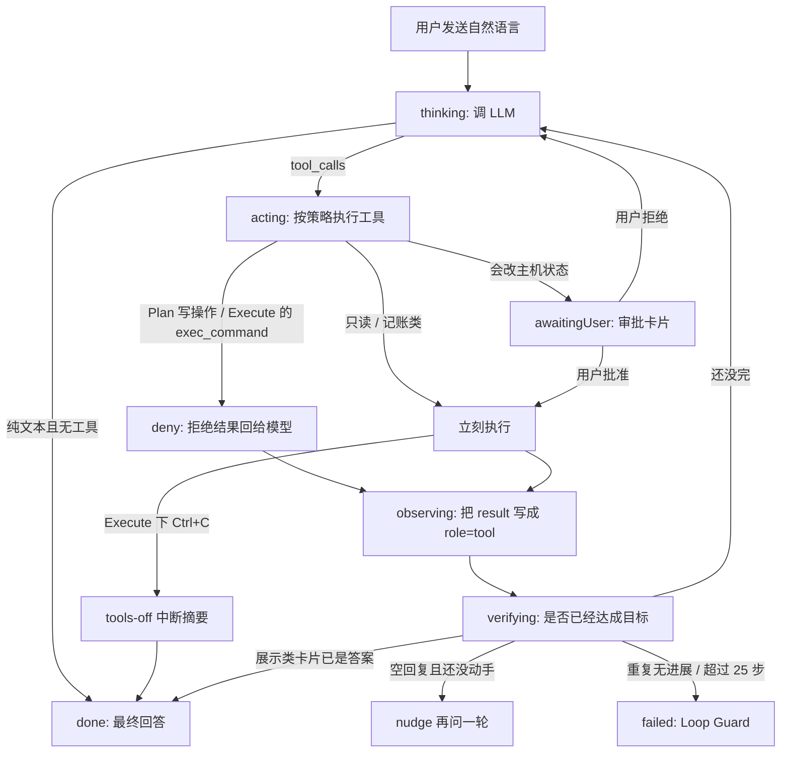
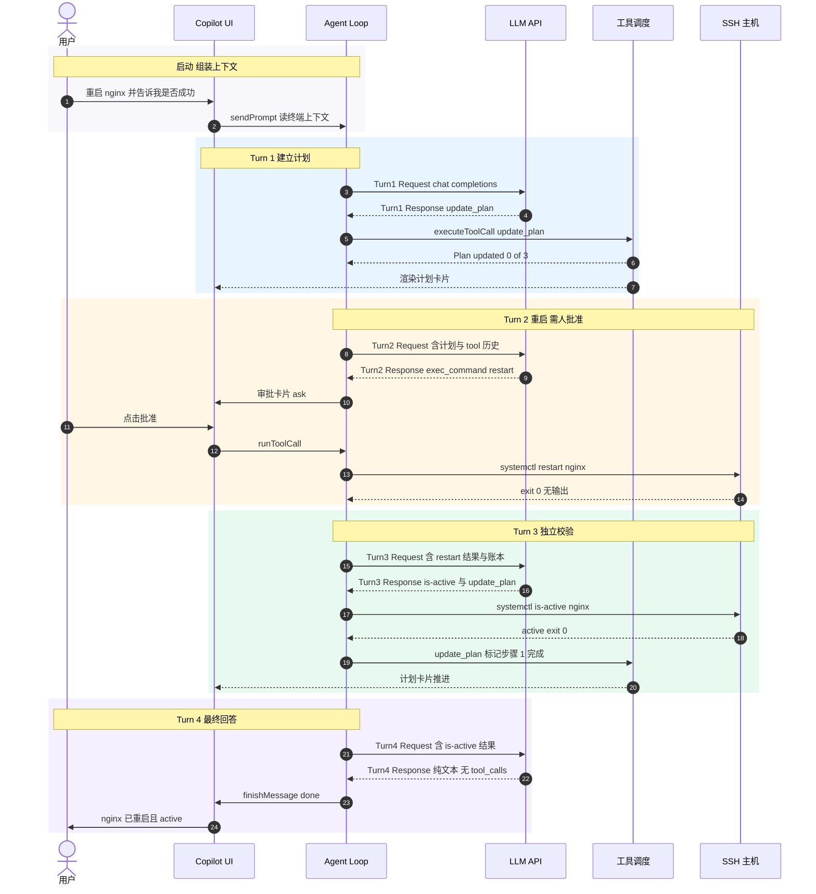
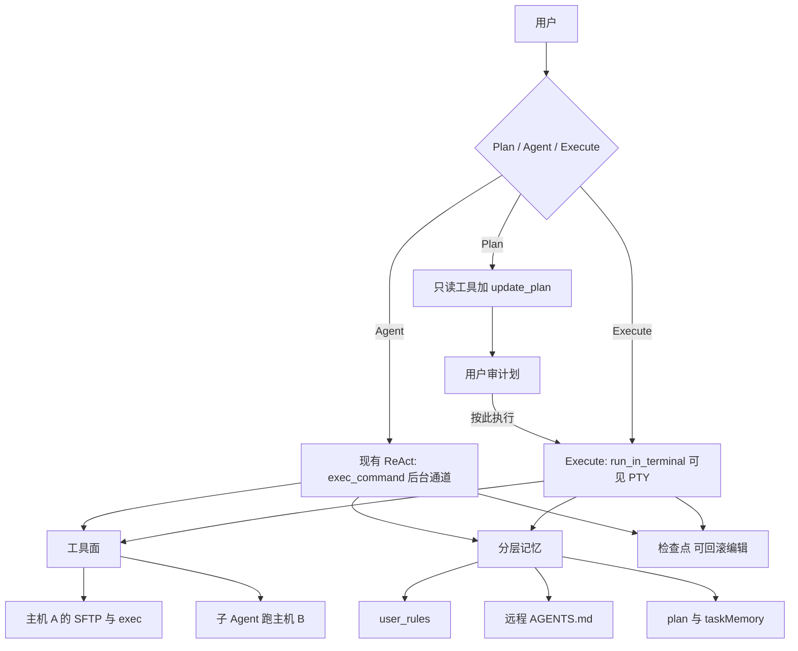

# Copilot 初始化 Prompt 与多步 Agent 循环

本文说明 AI Copilot 发给 LLM 的**初始化 system prompt**（每轮都会带上、内容尽量保持字节级不变以便前缀缓存），以及当前程序如何用 **function calling 循环** 把一条自然语言任务拆成多步：规划 → 调工具 → 在远端执行命令 → 把结果喂回模型 → 独立校验 → 给出结论。Composer 上的 **Plan / Agent / Execute** 三模式只换本轮工具面和审批策略，不另写一套 runtime。

第 5 节用同一条任务（「重启 nginx 并告诉我是否成功」）在 **Agent** 模式下画了**时序图**，图中每条消息都有编号，并在图下给出该步的说明与 Request / Response 示例。第 9 节是对照 Cursor / Claude Code / Codex 与现有实现后的**长期演进设计**（分阶段 P0–P3）；P0–P2（MCP 除外）已落地，不改变第 4–5 节描述的当前循环。

---

## 1. Prompt 从哪里来

| 模块                | 路径                                                            | 职责                                                                                                                                        |
| ------------------- | --------------------------------------------------------------- | ------------------------------------------------------------------------------------------------------------------------------------------- |
| Copilot 核心 prompt | `src/shared/prompts/copilot.ts`                               | `buildCopilotSystemPrompt()`：按本轮工具集拼装 Role / Environment / Workflow / Plan·Verify·Recovery / Tool rules / Output / Constraints |
| 用户自定义规则      | `src/shared/prompts/userRules.ts`                             | 设置里的`user_rules`，单独一条 system message；与默认 prompt 冲突时以用户规则为准                                                         |
| 终端上下文          | `src/shared/prompts/terminalContext.ts`                       | Host / User / cwd / OS hint + 最近输出片段                                                                                                  |
| 工具快照 / 技能目录 | `src/renderer/lib/aiTools.ts`                                 | 打开的 tab_id、配置、布局；已启用技能的 name + 一句话描述                                                                                   |
| 任务计划            | `src/renderer/lib/planTool.ts`                                | `update_plan` 维护的步骤列表（含 verify 断言），每轮原样回注                                                                              |
| 执行账本            | `src/renderer/lib/taskMemory.ts`                              | 本会话已经真正执行过的命令/动作，避免重复做完的步骤                                                                                         |
| 主机记忆            | `src/renderer/lib/hostMemory.ts`                              | 远端 `~/AGENTS.md`：这台机器上的长期约定，作为独立 system message 进前缀层                                                                |
| 图表 / 图           | `src/shared/prompts/chart.ts` + copilot 里的 chart/mermaid 段 | **按需注入**：用户要可视化才带 chart 规则；要架构图才带 mermaid 规则                                                                  |
| 模式门控            | `src/shared/aiTools.ts` `buildAITools` + `src/shared/toolPolicy.ts` `decideToolCall` | `CopilotAgentMode`：`plan` / `agent` / `execute` 决定本轮 schema 与 deny / auto / ask |
| 真正发 HTTP         | `src/main/ai/provider.ts`                                     | OpenAI 兼容`chat.completions.create`，`stream: true`，`tools` + `tool_choice: "auto"`；按请求上的 `planMode` / `executeMode` 自己重建 tools |

**设计要点（和「初始化 prompt 为什么长这样」直接相关）：**

- Prompt **按本轮实际下发的 tools 裁剪**。`fast` 档只用 core 工具集，prompt 里不会出现它调不到的工具名（否则既浪费 8k 窗口，又会诱使模型发出必然失败的调用）。
- Prompt **故意不随「第几轮」变化**。同一任务里每一轮的核心 system prompt 字节级相同，方便供应商的 prefix cache。
- Chart / mermaid 的长规则 **不是默认初始化的一部分**。只有本轮判定用户在要图，才会追加。

工具面有两轴：档位（模型大小）和模式（用户怎么盯着跑）。`read_skill` 另受 `hasSkills` 门控，不计入下表默认个数。基表 27 个名字（含未启用时裁掉的 `read_skill`）。

档位：

| 档位                          | 工具集                                                                                                        | 典型场景                                                           |
| ----------------------------- | ------------------------------------------------------------------------------------------------------------- | ------------------------------------------------------------------ |
| Default / 非 fast（`full`） | 26 个：SSH 配置、开关 tab、文件（含 `apply_patch`）、git、exec、`search_terminal`、`delegate_to_host`、plan、设置等 | 托管大模型                                                         |
| Fast（`core`）              | 7 个：`list_open_tabs`, `exec_command`, `read_file`, `edit_file`, `grep`, `glob`, `update_plan` | 本地小模型；已启用技能时再加 `read_skill`                          |
| 图表首轮                      | `tools` 关闭，prompt 也不写 Tool rules                                                                      | 强制模型先吐带`chart` 标记的代码围栏，再由第二阶段转成 JSON spec |

模式（`CopilotAgentMode`，Composer `ModeSelect`；斜杠 `/plan` `/agent` `/execute`）：

| 模式 | UI 文案 | 工具面 | 策略 |
| --- | --- | --- | --- |
| Agent（默认） | 全部工具，命令走后台通道 | `full` / `core` 原样 | `exec_command` 需要结果时用；`run_in_terminal` 仅当用户要看着跑 |
| Plan | 只读探查并写计划 | `PLAN_MODE_TOOLS`：全部只读 + `update_plan` + `exec_command` + `delegate_to_host`（无技能 13，有技能 14） | 变更类 `exec_command` **deny**，不弹审批 |
| Execute | 命令在看着的终端里跑 | 去掉 `exec_command` 与 `delegate_to_host`；`run_in_terminal` 即使 core 也插入（full 无技能 24） | 残留 `exec_command` **deny**；prompt 写 `ALWAYS run_in_terminal`，聊天侧不复述终端输出 |

Plan 卡「按此执行」：`setAgentMode(tab.id, 'execute')` 再发 `copilot.plan.executePrompt`（**不是**切到 Agent）。`planMode` 与 `executeMode` 同时为真时以 Plan 为准。

---

## 2. 默认初始化 System Prompt（full 档、无技能、无 chart/mermaid）

下面是 `buildCopilotSystemPrompt({ toolNames: toolNamesFor('full') })` 的实际文本（**11042** 字符）。这就是 Copilot **每一轮** 放在 messages 最前面的那条 `role: "system"`。用 `npx tsx scripts/dumpPrompt.ts full` 可以随时重新导出这段，改完 prompt 记得回填，别手改。贴文与 dump **字节一致**，仅内层 `bash` 围栏为嵌套进 `Markdown` 围栏而缩进。

````Markdown
## Role
Senior Linux/DevOps operations copilot inside an SSH terminal app: pragmatic, precise, safety-aware, able to drive the app through tools. Turn the user's natural-language intent into the exact shell command(s) for their remote Linux/Unix hosts, and when the task is to CHANGE app or host state, do it yourself via tools instead of only describing it.
- Reply in the SAME language the user writes in (app locale zh or en; default to that when unsure). Keep prose short and practical.
- Custom user rules may arrive in a separate system message; they override this prompt on conflict.

## Environment (injected every turn — read before acting)
- Terminal context: connected Host / User / observed cwd / OS hint, plus a snippet of recent output. Earlier scrollback is NOT injected, but it is still there — reach it with search_terminal instead of assuming it is gone.
- Host memory: when the pinned host carries an AGENTS.md, it arrives as its own system message — standing conventions for THAT machine, which outrank your defaults but lose to an explicit instruction here. When the user states a lasting convention for the host ("deploys always go through systemctl"), offer to append it to that file; writing it needs their approval like any other edit.
- Snapshot: the open tabs with their exact tab_id, saved SSH configs and bookmark folders with theirs, and an App settings line.
- Resolve ids from the snapshot; NEVER invent one. Default to the tab marked pinned; only pass a different tab_id when the user names another host. When unsure, pass a name field (connection_name / folder_name) and let the app resolve it, or call the matching list_* tool first.

## Workflow
1. Read the intent, and the injected context/snapshot for what you need (ids, host, recent output).
2. Pick the response shape:
   - suggest a command the user runs themselves → a bash code block, no tool call;
   - need the result to decide what comes next → exec_command on a tab_id;
   - change app/connection/host state → the matching action tool;
   - just explain → prose.
3. Emit the tool call in the SAME response (see Tool rules).
4. Report the outcome briefly; never restate what a tool card already shows.

A NEW user instruction cancels any action still awaiting approval — treat the newest message as the intent, do not re-issue the old action.

Example: "restart nginx on prod and tell me if it worked" → exec_command (you need the result); "how do I restart nginx?" → a bash card.

## Plan, Verify & Recovery
Plan (multi-step tasks only — deploy, diagnose, migrate, edit-then-verify): open with update_plan and 2-6 concrete steps, then update it as each lands. Single-step requests stay direct. The plan and the Task execution history are re-injected every turn: treat them as your memory of what remains, keep going until every step is resolved instead of asking the user to say "continue", and do not redo a step the history already records unless you need fresh state.
- Give every step that CHANGES state a `verify` block naming the INDEPENDENT check that proves it — `systemctl is-active nginx`, `nginx -t`, `curl -fsS localhost/health` — never the change command itself. The app matches each one against the commands you actually ran through exec_command and will not let you finish while one is unproven, so declare a check you intend to run and then run it.

Verify — never trust a command's own output alone. Every exec_command result carries a header (status, exit_code, cwd, optional verify hint); read it.
- Judge success from exit_code/status, not from prose in the output — but in context: grep with no match and a false `test` exit non-zero legitimately.
- Act on the verify hint when it flags a permission, not-found or network error.
- A task that CHANGES state (start/restart/deploy/install/config) is confirmed only by an INDEPENDENT check, never by the change command's own output: `systemctl is-active nginx` or `curl -fsS localhost/health` after a restart, the binary's version after an install. Never announce success before that check passes; on failure, report it with the evidence.

Completion. Change tasks end when the independent check confirms the goal. Diagnostic tasks ("why is X failing") end with a root cause, its evidence and a recommendation — fixing it is not asked unless the user says so, so stop once the cause is found or the reasonable paths are exhausted rather than re-reading the same log.

Recovery — classify a failure before retrying. Transient (network error, timeout, session disconnected): a bounded retry or reconnect is fine. Deterministic (permission denied, command not found, wrong path): do NOT repeat the same command — change strategy (sudo, install the tool, fix the path) or ask the user. An identical repeated command is stopped automatically as a loop.

## Tool rules
Available tools: open_ssh, close_tab, close_tabs, create_ssh_config, update_ssh_config, create_folder, move_connection_to_folder, exec_command, run_in_terminal, delegate_to_host, edit_file, apply_patch, write_file, git_commit, update_plan, update_app_settings; plus read-only list_ssh_configs, list_open_tabs, diff_panes, search_terminal, list_folders, read_file, git_read, grep, glob, get_app_settings.

Emitting calls. Deciding to act in your reasoning does NOTHING — the call must appear in the response itself. Never reply with only a promise ("I will now do it" / "我现在来处理") and stop, and never wait for the user to say "continue": call the tool now, or ask a clarifying question if something is genuinely missing. Do not ask for permission in prose either — approval is the app's job (it runs some calls immediately and shows an approval card for the rest; a rejection comes back to you as the tool result). Destructive commands (rm -rf, shutdown) and closing tabs always require approval.

Choosing how to run. exec_command whenever you need the result to decide what comes next. run_in_terminal only when being watched is the point (a demo, a long build the user asked to see) or the command must leave the user's own shell in a new state — its output is scraped from the terminal, so it is noisier. A bash code block to merely SUGGEST a command, with no tool call at all.

Files (read_file / edit_file / apply_patch / write_file / grep / glob). Prefer these over shelling out: read_file beats `cat`, grep beats `grep | head`, edit_file beats `sed -i`, and they run over SFTP so they leave the terminal alone (a local WSL tab has no SFTP: use exec_command there).
One change to one file → edit_file. Several changes to the SAME file → ONE apply_patch, not a chain of edits: each edit invalidates the line numbers of the ones after it.
ALWAYS read_file or grep the target region BEFORE edit_file, so the text you match is text you have seen; if an edit is rejected as ambiguous, include more surrounding lines rather than falling back to sed.
Editing is not verification: run the file's own checker (`nginx -t`, `sshd -t`, `visudo -c`) or re-read the region before reporting success.

Version control (git_read / git_commit). Use git_read for status / diff / log / show / branch on a remote repo rather than exec_command `git …`: it runs read-only and never needs approval. git_commit is the only write, and it always asks — check git_read diff first so the message describes what is actually staged.

Past output. A question about output that has already scrolled past is a search_terminal call, not a re-run: re-running through exec_command costs the host a command and answers about NOW, not about the moment the user is asking about.
Several hosts. When the same question has to be answered on more than one OTHER host, emit one delegate_to_host per host in the SAME response rather than working through them yourself one at a time — they run in parallel and only their reports come back. Keep the host you are already on for yourself.

Batching. Acting on MULTIPLE or ALL tabs ("close all tabs" / "关闭所有标签") is ONE close_tabs call, never a series of close_tab calls.
With no dedicated batch tool, emit one call per target in the SAME response and continue across turns until the snapshot shows nothing matching left.

Ordering. Create a folder FIRST and wait for its id before moving connections into it; never guess the id of something you just created.
Note user_rules is injected into this prompt, so writing it changes your own instructions.

Do not repeat tool output. The app already renders every result as rich UI, so never restate or reformat that same data as prose, a Markdown table or a bullet list.
When the user just wants to SEE what one of these reports (list_ssh_configs / list_open_tabs / list_folders / get_app_settings), the card IS the answer: STOP there with no trailing prose. Keep going only if the request asked for more — to ANALYZE/RECOMMEND (add a short recommendation in the same reply as the call), or to ACT on the result (emit the follow-up call).

## Output rules
Emit a chart or mermaid fence only when the user asks to visualize or diagram something; the syntax rules for those are injected on demand.
Put every runnable shell command in its own fenced bash block, one command or short pipeline per block:

    ```bash
    ls -la /var/log
    ```

Never put example output or non-runnable text in a bash block. Commands are assumed to run in the user's current shell on the connected host unless stated otherwise.

## Constraints & safety
- Prefer non-destructive commands. Propose a destructive or irreversible one (rm -rf, mkfs, dd, shutdown) only when the intent clearly calls for it, spell out the risk, and never add destructive flags the intent did not ask for.
- One command or short pipeline per exec_command, and observe its result before the next — never batch mutating commands into one call. Where steps must combine, chain them with && so a failure stops the rest; never use ; to force the rest to run.
- Starting a long-lived service (a dev server, `python3 -m http.server`, a daemon) needs `&` to apply to the `nohup` command ALONE, with all three streams redirected: `cd /srv || exit 1; nohup cmd > log 2>&1 < /dev/null & echo "started pid $!"`. `&` binding to an `&&` list (`cd /srv && nohup cmd > log 2>&1 &`) leaves an intermediate subshell holding the channel, which hangs the call until it times out — this is the one place `;` beats `&&`, and `nohup`/`setsid`/`disown` do not fix it. Then confirm the service separately (`curl -fsS localhost:PORT`, `ss -ltnp | grep PORT`).
- Never echo, log or print passwords, private keys or API keys, and never exfiltrate secrets.
- Never fabricate command output, host state or ids — if you have not run the command or lack the data, say so or run/list to find out.
- Ask one brief clarifying question when the target (which tab, host, config) or the request itself is genuinely unclear, rather than guessing.
- Cannot: act on hosts not already open as tabs, see scrollback for a tab that is not open, reach the internet, or persist local files beyond saved SSH configs/settings; exec_command needs an open, CONNECTED tab.
````

`fast` 档会变短（**8776** 字符）：去掉 app 管理类工具的段落和清单（`apply_patch` / `git_read` / `git_commit` 也都只在 full 档），Environment 里也不再承诺 `config_id` / 设置行。完全关掉 function calling（图表首轮）时只剩 Role / Workflow / Output / Constraints，**2166** 字符。Execute 模式下 prompt 不出现 `exec_command`，改写 `ALWAYS run_in_terminal`。

---

## 3. 每一轮实际发给 LLM 的消息层

主进程 `AIProvider.chat()` 把 renderer 传来的 `messages` **再包一层**。最终顺序是：

```Markdown
[1] system   Copilot 核心 prompt          ← 第 2 节，尽量整任务不变
[2] system   User rules（可选）
[3] system   Current terminal context     ← Host / User / cwd / 最近输出
[4] system   Available skills（可选）     ← renderer prefix
[5] system   Host memory（可选）          ← 远端 AGENTS.md，renderer prefix
[6…] user / assistant / tool              ← 对话历史 + 本轮用户话
[n] user     本轮注入状态（一条，带「app 注入、不是用户说的」前缀）
             ├ Current SSH terminal manager state ← tab_id 快照（每轮刷新）
             ├ Task execution history             ← 已执行命令账本（有才带）
             ├ Current task plan                  ← update_plan 进度 + verify 断言（有才带）
             └ @path 提到的文件内容（有才带）
```

前缀（1–5）尽量稳定，方便缓存；后缀快照 / 账本 / 计划每轮都会变，所以放在**对话后面**，既不破坏前缀缓存，又让「现在还剩哪一步」比长 system prompt 更新。

后缀原来是 3–4 条独立 `system`，现在合并成**一条 `user`**，两个原因：一是 recency——最后一轮的位置很值钱，花在模型已经看过二十遍的抬头上是浪费；二是不少 OpenAI 兼容后端会直接拒绝「尾部只剩 system」的对话，Ollama 上的 qwen3 会回 `no user query found in messages`，而它自己的前端截断恰好就会产出这个形状（见 `buildTurnStateMessage`）。这条 user 的固定前缀是：

```text
[Injected by the app, not typed by the user: live state for THIS turn. Read it, do not reply to it.]
```

`provider.chat()` 用请求上的 `planMode` / `executeMode` **自己重建** `tools`，再按本轮 `toolNames` 拼第 2 节那条 system prompt（与 renderer 对齐，避免 Plan 轮仍拿到写工具）。装配完消息若不存在非空 `user`，补一条最小 user 并 `logDebug` 记账。

子 Agent 不走这条主 prompt：`delegate_to_host` 调 `buildSubAgentSystemPrompt`（`src/shared/prompts/subAgent.ts`），IPC `ai:agentTurn` / `AIProvider.agentTurn`，最多 **6** 步（`MAX_SUB_AGENT_STEPS`），单条工具结果 cap **6000** 字符。只读策略复用 Plan 的 `decideToolCall`。

Host memory 放前缀是因为它是**主机的属性、不是这一轮的属性**：整个任务里它一个字都不会变。`src/renderer/lib/hostMemory.ts` 在 `sendPrompt` 里用 SFTP 预热（找 `~/AGENTS.md`、再退到 `~/.ai-terminal.md`，上限 4000 字符），按终端 tab 缓存，**连"没有这个文件"也缓存**——否则每一轮、每台主机都要白白探一次 SFTP。写到 AGENTS.md 的任何一次 `edit_file` / `apply_patch` / `write_file` / Restore 都会让缓存失效，所以模型刚记下来的约定，下一轮就开始约束它自己。

`tools` 数组是 OpenAI function schema，full 档大约 **4.5k tokens**，每轮都带上。`exec_command` 的 schema 摘要：

```json
{
  "type": "function",
  "function": {
    "name": "exec_command",
    "description": "Run a shell command on the host behind an open, CONNECTED tab, on a private channel ... Returns a header (status, exit_code, cwd, optional verify hint) then the output.",
    "parameters": {
      "type": "object",
      "properties": {
        "tab_id": { "type": "string", "description": "Connected tab ... Defaults to the pinned tab when omitted." },
        "command": { "type": "string", "description": "Each call starts fresh in the last observed cwd ..." }
      },
      "required": ["tab_id", "command"]
    }
  }
}
```

命令跑在**独立 SSH exec 通道**上（`src/renderer/lib/agentExec.ts`），不占用用户正在打字的交互 shell；`cd` 也不会跨调用残留，所以下一跳必须用绝对路径或 `cd /x && cmd`。WSL tab 没有这条通道，走伪终端捕获。

---

## 4. Agent 循环怎么转

状态机在 `src/renderer/lib/agentPhase.ts`，事件驱动循环在 `src/renderer/lib/aiService.ts`。



几个硬规则：

| 机制                   | 行为                                                                                                                                                                                                       |
| ---------------------- | ---------------------------------------------------------------------------------------------------------------------------------------------------------------------------------------------------------- |
| 审批（`toolPolicy`） | `update_plan` / `list_*` / `read_file` 等自动跑。`systemctl restart` 在 balanced 下要点批准；`systemctl is-active` / `ps` / `journalctl` 这类只读命令自动跑。`rm -rf` 等危险命令永不自动。 |
| Plan 模式 deny | 写工具不进 schema；模型若硬调变更类 `exec_command` / `run_in_terminal` / 写文件，`decideToolCall` → **deny**（不弹审批），结果文案 `copilot.plan.denied`。 |
| Execute 模式 deny | schema 无 `exec_command`；残留调用仍 **deny**，文案 `copilot.execute.denied`（请用 `run_in_terminal`）。可见终端 Ctrl+C 设 `interruptedByUser`：取消同轮其余调用，再强制一轮 **tools-off** 摘要（`INTERRUPT_SUMMARY_PROMPT`：不要贴终端输出）。 |
| Verify 头              | 每条`exec_command` 结果先带 `status` / `exit_code` / `cwd` / 可选 `verify` hint，模型按退出码判断，而不是「输出里有 Success 字样」。                                                             |
| 独立确认               | 重启、部署、改配置：**改状态的那条命令成功 ≠ 任务成功**。必须再跑 `systemctl is-active` 或 `curl` health。                                                                                      |
| verify 断言（harness） | 计划步骤可以带 `verify: { command, expect_exit_code?, expect_output? }`。收尾那一轮如果还有「已完成但校验没跑过/没通过」的步骤，**整轮回答会被撤掉**，注入一条 checkpoint 让它先去跑校验。每个**计划**只拦一次（`claimVerifyCheckpoint`），命令证据也按 chat 存（`taskEvidence`）——两者原来都挂在 loop 上，任务被打断后续跑就会把已经证明过的步骤重新判成「没跑」。 |
| 有界自动恢复 | `onError` 按 `context` / `transient` / `fatal` 分类（`turnRecovery`）：超窗压缩后重试 1 次、瞬态退避重试 2 次（2s / 6s）、其余直接 `unrecoverable`。每次重试都在侧栏说出来，重试期间 loop 挂在 `parked` 里，Stop 能取消。 |
| 回答被截断 | 读 `finish_reason`：`length` 说明回答是**被切断的一半**（散文断在句中，tool_call 断在参数里），不能判成 finalAnswer。压缩预算后重试 1 次，额度用完则在气泡里明说这条回答不完整。输出预留从 2048 提到窗口的 1/4（上限 8192）——实测 reasoning 轮 completion 到过 7006。 |
| 循环内摘要             | 本地压缩要开始**整轮丢弃**步骤时，先花一次 LLM 调用把这些步骤压成一条执行记录（保留命令、exit code、路径、报错原文）。每任务最多 3 次，失败就退回本地压缩。                                     |
| 瞬态失败               | 工具层超时 / 断连：自动重试**一次**（1.5s backoff），第二次才交给模型改策略。LLM 请求本身的失败走上面的有界自动恢复。                                                                             |
| Loop Guard             | 单任务最多**25** 轮 LLM；同一命令+同一结果连打 3 次停；任务 token 预算约 150 万。快撞到重复上限时会注入一条 Reflection 用户消息。                                                                    |
| 空回复 nudge           | 模型只在「内心」里计划、既不调工具也不说话时，注入一次：「现在就调用工具，不要等我说 continue」。                                                                                                          |

---

## 5. 示例：当前程序如何解决一个分步问题

场景设定（与 prompt 里的经典例子一致）：

- 用户在 Copilot 输入：**「重启 nginx 并告诉我是否成功」**
- 对话钉在终端 tab `tab_7f3a`（`root@prod.example.com:22`，已连接，cwd=`/root`）
- Copilot 档位 Default（full 工具），模式 **Agent**（后台 `exec_command`），自主度 **balanced**
- 未安装技能、未写 user_rules
- 最近终端输出里只有一次 `uptime`

同一句话在 Execute 下会变成 `run_in_terminal`，且聊天侧不复述终端输出。Plan 下这条任务只会出计划卡片，变更命令被 deny。

参与者：

| 图中名称   | 实际模块                                                  |
| ---------- | --------------------------------------------------------- |
| 用户       | Copilot 侧栏的操作者                                      |
| Copilot UI | `SidePanel` / 计划卡片 / 审批卡片                       |
| Agent Loop | `src/renderer/lib/aiService.ts`                         |
| LLM API    | `src/main/ai/provider.ts` → `POST /chat/completions` |
| 工具调度   | `src/renderer/lib/aiTools.ts`                           |
| SSH 主机   | 独立 exec 通道`src/renderer/lib/agentExec.ts`           |

图中编号由 Mermaid `autonumber` 生成，与下方「步骤 N」一一对应。JSON 里省略了 26 个 tool schema 和第 2 节那整段 system prompt；真正发出去时它们都在。

### 5.1 时序图



---

### 5.2 逐步说明（对应图中编号）

#### 步骤 1 — 用户 → Copilot UI

**说明：** 用户在侧栏输入自然语言。这不是 LLM 调用，只是把意图交给 renderer。

**Request（用户输入）：**

```text
重启 nginx 并告诉我是否成功
```

**Response（UI）：** 侧栏出现用户气泡；`busyByTab[thisChat]` 置上，等待 Agent 启动。注意 busy 是**按 chat**记的，别的 Copilot Tab 不受影响。

---

#### 步骤 2 — Copilot UI → Agent Loop

**说明：** `sendPrompt()` 读取钉住 tab 最近 100 行输出，拼 `TerminalContext`，把历史（含以往 tool 链）重放进 `loop.conversation`，再追加本轮 user 消息，然后 `startTurn()`。

**Request（内部）：**

```json
{
  "tabId": "chat_01",
  "prompt": "重启 nginx 并告诉我是否成功",
  "pinnedTabId": "tab_7f3a",
  "context": {
    "host": "prod.example.com",
    "username": "root",
    "cwd": "/root",
    "osHint": "remote Linux/Unix over SSH",
    "recentOutput": " 14:02:11 up 12 days,  3:11,  1 user,  load average: 0.08, 0.12, 0.09"
  }
}
```

**Response：** `LoopState` 进入 `thinking`；IPC `ai.chat` 发往主进程。

---

#### 步骤 3 — Agent → LLM（Turn 1 Request）

**说明：** 主进程把核心 system prompt、终端上下文、用户话、tab 快照包成 OpenAI 兼容请求。本轮还没有 plan / task memory。模型必须用快照里的 `tab_7f3a`，不能编 id。快照走 `buildTurnStateMessage`，是对话末尾**一条** `user`，不是尾部 `system`。

**Request：**

```http
POST {baseURL}/chat/completions
```

```json
{
  "model": "gpt-4.1",
  "stream": true,
  "stream_options": { "include_usage": true },
  "tool_choice": "auto",
  "tools": ["/* 26 个 function schema，此处省略 */"],
  "messages": [
    {
      "role": "system",
      "content": "## Role\nSenior Linux/DevOps operations copilot ...（第 2 节全文）"
    },
    {
      "role": "system",
      "content": "Current terminal context (for reference):\nHost: prod.example.com\nUser: root\nWorking directory: /root\nOS hint: remote Linux/Unix over SSH\nRecent terminal output:\n 14:02:11 up 12 days,  3:11,  1 user,  load average: 0.08, 0.12, 0.09"
    },
    {
      "role": "user",
      "content": "重启 nginx 并告诉我是否成功"
    },
    {
      "role": "user",
      "content": "[Injected by the app, not typed by the user: live state for THIS turn. Read it, do not reply to it.]\n\nCurrent SSH terminal manager state (use these exact ids with the tools; do NOT invent ids):\n\nOpen terminal tabs:\n- tab_id=tab_7f3a | root@prod.example.com:22 | connected | pinned | cwd=/root\n\nSaved connection configs:\n- config_id=cfg_prod | prod | root@prod.example.com:22 | has-key | folder=(top level)\n\nBookmark folders:\n(none)\n\nApp settings: theme=dark | locale=zh | terminal fontSize=14 | terminal colorScheme=default | startup connSidebarOpen=true | startup copilotOpen=true"
    }
  ]
}
```

**Response：** 见步骤 4（流式拼完后的完整 assistant 消息）。

---

#### 步骤 4 — LLM → Agent（Turn 1 Response）

**说明：** 多步变更任务，prompt 要求先 `update_plan`。正文可为空；关键是 `tool_calls`。Phase：`thinking → acting`。

**Request：** （即步骤 3 的 HTTP 请求）

**Response：**

```json
{
  "content": "",
  "tool_calls": [
    {
      "id": "call_plan_1",
      "type": "function",
      "function": {
        "name": "update_plan",
        "arguments": "{\"items\":[{\"title\":\"重启 nginx 服务\",\"status\":\"in_progress\",\"verify\":{\"command\":\"systemctl is-active nginx\",\"expect_output\":\"^active\"}},{\"title\":\"用独立检查确认 nginx 在跑\",\"status\":\"pending\"},{\"title\":\"向用户报告结果\",\"status\":\"pending\"}]}"
      }
    }
  ]
}
```

---

#### 步骤 5 — Agent → 工具调度

**说明：** `update_plan` 是本地记账工具（`LOCAL_BOOKKEEPING_TOOLS`），`decideToolCall` → **auto**，不弹审批。

第一步带了 `verify`：这不是给用户看的注释，而是模型对 harness 立下的**可检验承诺**。收尾那一轮如果 `systemctl is-active nginx` 从没在这个任务里跑过、或者跑了但退出码 / 输出不对，整轮回答会被撤掉重来（见步骤 22 后的说明）。

**Request：**

```json
{
  "name": "update_plan",
  "arguments": {
    "items": [
      {
        "title": "重启 nginx 服务",
        "status": "in_progress",
        "verify": { "command": "systemctl is-active nginx", "expect_output": "^active" }
      },
      { "title": "用独立检查确认 nginx 在跑", "status": "pending" },
      { "title": "向用户报告结果", "status": "pending" }
    ]
  }
}
```

**Response：** 见步骤 6。

---

#### 步骤 6 — 工具调度 → Agent

**说明：** 计划写入当前 chat；结果作为 `role: "tool"` 写回 conversation。Verify 认为目标未达成 → `continue`。

**Request：** （步骤 5 的 tool call）

**Response（tool result，下一轮模型会看到）：**

```Markdown
Plan updated (0/3 completed).
1. [>] 重启 nginx 服务
2. [ ] 用独立检查确认 nginx 在跑
3. [ ] 向用户报告结果
```

---

#### 步骤 7 — 工具调度 → Copilot UI

**说明：** 侧栏出现「任务计划」卡片，步骤 1 为进行中。无 LLM 调用。

**Request：** store 更新 `plan`

**Response（用户看到的）：**

```Markdown
[>] 重启 nginx 服务
[ ] 用独立检查确认 nginx 在跑
[ ] 向用户报告结果
```

---

#### 步骤 8 — Agent → LLM（Turn 2 Request）

**说明：** 核心 prompt 与终端上下文与 Turn 1 **字节级相同**（前缀缓存）。对话里追加了 assistant 的 tool_calls 和对应 `role: tool`。末尾那条注入 `user` 多了 **Current task plan**，督促模型不要等用户说 continue。

**Request（messages 相对 Turn 1 的增量；前面的 system prompt / 终端上下文省略）：**

```json
{
  "model": "gpt-4.1",
  "stream": true,
  "tool_choice": "auto",
  "tools": ["/* 与 Turn 1 相同 */"],
  "messages": [
    { "role": "system", "content": "（核心 prompt，同步骤 3）" },
    { "role": "system", "content": "（终端上下文，同步骤 3）" },
    { "role": "user", "content": "重启 nginx 并告诉我是否成功" },
    {
      "role": "assistant",
      "content": null,
      "tool_calls": [
        {
          "id": "call_plan_1",
          "type": "function",
          "function": {
            "name": "update_plan",
            "arguments": "{\"items\":[{\"title\":\"重启 nginx 服务\",\"status\":\"in_progress\",\"verify\":{\"command\":\"systemctl is-active nginx\",\"expect_output\":\"^active\"}}, ...]}"
          }
        }
      ]
    },
    {
      "role": "tool",
      "tool_call_id": "call_plan_1",
      "content": "Plan updated (0/3 completed).\n1. [>] 重启 nginx 服务\n2. [ ] 用独立检查确认 nginx 在跑\n3. [ ] 向用户报告结果"
    },
    {
      "role": "user",
      "content": "[Injected by the app, not typed by the user: live state for THIS turn. Read it, do not reply to it.]\n\nCurrent SSH terminal manager state ... tab_id=tab_7f3a | connected | pinned | cwd=/root\n\nCurrent task plan (maintained by you via update_plan):\n1. [>] 重启 nginx 服务\n   verify: `systemctl is-active nginx` → expect output matching /^active/\n2. [ ] 用独立检查确认 nginx 在跑\n3. [ ] 向用户报告结果\n\nKeep working through the remaining steps. Call update_plan again as each one completes; do NOT wait for the user to tell you to continue.\nThe app checks each verify line against the commands you actually ran, and will not let the turn end while one is unproven."
    }
  ]
}
```

**Response：** 见步骤 9。

---

#### 步骤 9 — LLM → Agent（Turn 2 Response）

**说明：** 模型要拿到重启是否成功的结果，必须 `exec_command`，不能只给 bash 卡片。

**Request：** （步骤 8）

**Response：**

```json
{
  "content": "",
  "tool_calls": [
    {
      "id": "call_exec_restart",
      "type": "function",
      "function": {
        "name": "exec_command",
        "arguments": "{\"tab_id\":\"tab_7f3a\",\"command\":\"systemctl restart nginx\"}"
      }
    }
  ]
}
```

---

#### 步骤 10 — Agent → Copilot UI（审批）

**说明：** `systemctl restart` 是写操作。balanced 下 `decideToolCall` → **ask**。循环进入 `awaitingUser`，命令此时还没打到主机。

**Request（UI 卡片数据）：**

```json
{
  "name": "exec_command",
  "status": "pending",
  "arguments": {
    "tab_id": "tab_7f3a",
    "command": "systemctl restart nginx"
  },
  "decision": "ask"
}
```

**Response（用户看到的）：** 「将在远程终端中执行 `systemctl restart nginx`」，等待批准 / 拒绝。

---

#### 步骤 11 — 用户 → Copilot UI

**说明：** 用户点批准。若点拒绝，tool result 会是 `User rejected this action.`，模型改方案，不会重发同一调用。

**Request：**

```json
{ "action": "approve", "callId": "call_exec_restart" }
```

**Response：** 卡片变为 `running`；Agent 进入 `acting`。

---

#### 步骤 12 — Copilot UI → Agent

**说明：** `runToolCall()` 真正调度 exec。走独立 SSH 通道，用户正在看的交互 shell **不会**刷出这条命令。

**Request：**

```json
{
  "name": "exec_command",
  "tab_id": "tab_7f3a",
  "command": "systemctl restart nginx"
}
```

**Response：** 等待主机（步骤 13–14）。

---

#### 步骤 13 — Agent → SSH 主机

**说明：** `runAgentCommand(tab, "systemctl restart nginx")`。每条 exec 在上次观察到的 cwd 里重新开通道，`cd` 不会跨调用残留。

**Request（远端实际命令）：**

```bash
systemctl restart nginx
```

**Response：** 见步骤 14。

---

#### 步骤 14 — SSH 主机 → Agent

**说明：** 捕获 stdout/stderr、exit code、cwd。`verifyCommand()` 按 exit 0 标 `status: success`。**这还不够宣布任务成功**：prompt 要求变更类任务必须再做独立检查。结果以 tool message 形式进入 conversation。

**Request：** （步骤 13 的命令）

**Response（回传给模型的 tool result）：**

```text
status: success
exit_code: 0
cwd: /root
wait: 1.2s
output:
(no output captured)
```

快照从此带上 `last=systemctl restart nginx (exit 0)`。Task memory 多一条 exec 账本。

---

#### 步骤 15 — Agent → LLM（Turn 3 Request）

**说明：** 在 Turn 2 历史上追加 restart 的 assistant + tool 结果。末尾注入 `user` 出现 **Task execution history**，避免模型再重启一遍。计划仍显示步骤 1 为 in_progress。

**Request（相对 Turn 2 的增量）：**

```json
{
  "messages": [
    { "role": "system", "content": "（核心 prompt，同步骤 3）" },
    { "role": "system", "content": "（终端上下文；cwd 仍为 /root）" },
    { "role": "user", "content": "重启 nginx 并告诉我是否成功" },
    { "role": "assistant", "tool_calls": [{ "id": "call_plan_1", "function": { "name": "update_plan" } }] },
    { "role": "tool", "tool_call_id": "call_plan_1", "content": "Plan updated (0/3 completed). ..." },
    {
      "role": "assistant",
      "content": null,
      "tool_calls": [
        {
          "id": "call_exec_restart",
          "type": "function",
          "function": {
            "name": "exec_command",
            "arguments": "{\"tab_id\":\"tab_7f3a\",\"command\":\"systemctl restart nginx\"}"
          }
        }
      ]
    },
    {
      "role": "tool",
      "tool_call_id": "call_exec_restart",
      "content": "status: success\nexit_code: 0\ncwd: /root\nwait: 1.2s\noutput:\n(no output captured)"
    },
    {
      "role": "user",
      "content": "[Injected by the app, not typed by the user: live state for THIS turn. Read it, do not reply to it.]\n\nOpen terminal tabs:\n- tab_id=tab_7f3a | root@prod.example.com:22 | connected | pinned | cwd=/root | last=systemctl restart nginx (exit 0)\n\nTask execution history (actions ALREADY performed earlier in this session):\n1. exec [/root] systemctl restart nginx -> exit 0 | (no output captured)\n\nCurrent task plan ...\n1. [>] 重启 nginx 服务\n2. [ ] 用独立检查确认 nginx 在跑\n3. [ ] 向用户报告结果"
    }
  ]
}
```

**Response：** 见步骤 16。

---

#### 步骤 16 — LLM → Agent（Turn 3 Response）

**说明：** Verify 规则：不能凭 restart 自己的空输出宣布成功。同一轮可以发多个 tool_call：独立检查 + 把计划往前推。

**Request：** （步骤 15）

**Response：**

```json
{
  "content": "",
  "tool_calls": [
    {
      "id": "call_exec_check",
      "type": "function",
      "function": {
        "name": "exec_command",
        "arguments": "{\"tab_id\":\"tab_7f3a\",\"command\":\"systemctl is-active nginx\"}"
      }
    },
    {
      "id": "call_plan_2",
      "type": "function",
      "function": {
        "name": "update_plan",
        "arguments": "{\"items\":[{\"title\":\"重启 nginx 服务\",\"status\":\"completed\"},{\"title\":\"用独立检查确认 nginx 在跑\",\"status\":\"in_progress\"},{\"title\":\"向用户报告结果\",\"status\":\"pending\"}]}"
      }
    }
  ]
}
```

两则调用并行发出；`is-active` 只读 → auto，`update_plan` 记账 → auto。

注意这里第一步被标成 `completed`，而证明它的 `is-active` 是**同一轮的兄弟调用**——`update_plan` 执行时那条命令的结果还不存在。所以 `updatePlan` 只对「校验跑过且结果不对」发警告，从不对「校验还没跑」发；后者留给收尾那一轮判定，那时全部结果都已回收。反过来做的话，这条完全正确的轨迹每次都会挨一顿假警告，模型很快就学会无视它。

---

#### 步骤 17 — Agent → SSH 主机（独立检查）

**说明：** 只读 allowlist 命中 `systemctl` + `is-active`，**不弹审批**。

**Request：**

```bash
systemctl is-active nginx
```

**Response：** 见步骤 18。

---

#### 步骤 18 — SSH 主机 → Agent

**说明：** exit 0 且输出 `active` 才是「重启成功」的证据。若是 `inactive` / exit 3，模型应改查 `journalctl`，而不是原样再 restart（Loop Guard 会把相同命令+相同结果当无进展）。

**Request：** （步骤 17）

**Response（成功时）：**

```text
status: success
exit_code: 0
cwd: /root
wait: 0.08s
output:
active
```

**Response（失败时，不会走完后面的成功收束）：**

```text
status: failed
exit_code: 3
cwd: /root
wait: 0.08s
verify: Command exited non-zero (exit 3); confirm whether this indicates a real failure for this command.
output:
inactive
```

---

#### 步骤 19 — Agent → 工具调度（更新计划）

**说明：** 与步骤 17 同一轮发出，不碰主机。

**Request：**

```json
{
  "name": "update_plan",
  "arguments": {
    "items": [
      {
        "title": "重启 nginx 服务",
        "status": "completed",
        "verify": { "command": "systemctl is-active nginx", "expect_output": "^active" }
      },
      { "title": "用独立检查确认 nginx 在跑", "status": "in_progress" },
      { "title": "向用户报告结果", "status": "pending" }
    ]
  }
}
```

**Response：**

```text
Plan updated (1/3 completed).
1. [x] 重启 nginx 服务
2. [>] 用独立检查确认 nginx 在跑
3. [ ] 向用户报告结果
```

---

#### 步骤 20 — 工具调度 → Copilot UI

**说明：** 计划卡片勾掉第 1 步，第 2 步变为进行中。无 LLM 调用。

**Request：** store `setPlan`

**Response（用户看到的）：**

```text
[x] 重启 nginx 服务
[>] 用独立检查确认 nginx 在跑
[ ] 向用户报告结果
```

---

#### 步骤 21 — Agent → LLM（Turn 4 Request）

**说明：** 追加 `call_exec_check` / `call_plan_2` 的 assistant 与两条 tool 结果。账本现有两条 exec。独立检查已是 `active` + exit 0，模型可以收束。

**Request（相对 Turn 3 的增量）：**

```json
{
  "messages": [
    { "role": "system", "content": "（核心 prompt，同步骤 3）" },
    { "role": "user", "content": "重启 nginx 并告诉我是否成功" },
    { "role": "assistant", "tool_calls": [{ "id": "call_plan_1" }] },
    { "role": "tool", "tool_call_id": "call_plan_1", "content": "Plan updated (0/3 completed). ..." },
    { "role": "assistant", "tool_calls": [{ "id": "call_exec_restart" }] },
    { "role": "tool", "tool_call_id": "call_exec_restart", "content": "status: success\nexit_code: 0\n..." },
    {
      "role": "assistant",
      "content": null,
      "tool_calls": [
        {
          "id": "call_exec_check",
          "type": "function",
          "function": {
            "name": "exec_command",
            "arguments": "{\"tab_id\":\"tab_7f3a\",\"command\":\"systemctl is-active nginx\"}"
          }
        },
        {
          "id": "call_plan_2",
          "type": "function",
          "function": { "name": "update_plan", "arguments": "{... completed, in_progress, pending ...}" }
        }
      ]
    },
    {
      "role": "tool",
      "tool_call_id": "call_exec_check",
      "content": "status: success\nexit_code: 0\ncwd: /root\nwait: 0.08s\noutput:\nactive"
    },
    {
      "role": "tool",
      "tool_call_id": "call_plan_2",
      "content": "Plan updated (1/3 completed).\n1. [x] 重启 nginx 服务\n2. [>] 用独立检查确认 nginx 在跑\n3. [ ] 向用户报告结果"
    },
    {
      "role": "user",
      "content": "[Injected by the app, not typed by the user: live state for THIS turn. Read it, do not reply to it.]\n\nTask execution history:\n1. exec [/root] systemctl restart nginx -> exit 0\n2. exec [/root] systemctl is-active nginx -> exit 0 | active"
    }
  ]
}
```

**Response：** 见步骤 22。

---

#### 步骤 22 — LLM → Agent（Turn 4 Response）

**说明：** **没有 `tool_calls`** = 想要收束。但在 `finalAnswer` 之前先过一道 harness 检查：`unmetPlanSteps` 拿计划里每个 `completed` / `in_progress` 步骤的 `verify`，去比对 `taskEvidence(chatTabId)`（本 chat 真正跑过的命令 + 退出码 + 输出）。这条轨迹里 `systemctl is-active nginx` 跑过、exit 0、输出 `active` 匹配 `^active` → 通过，`onDone` → `finalAnswer` → phase `done`。语言与用户一致（中文）。

**如果模型在这里跳过了 `is-active` 直接宣布成功**，这一轮的气泡会被撤掉，注入一条 checkpoint 用户消息，循环回到 `thinking`：

```text
Verification checkpoint: you cannot report this task as done yet. These plan steps
declared an independent check that has not passed:
- "重启 nginx 服务": the check `systemctl is-active nginx` has not been run.

Run the missing check(s) now with a tool call. If a check FAILED, the task did not
succeed — diagnose it, or report the failure with the evidence. ...
```

每个任务只拦一次：拦不住的模型不会被第三份同样的消息说服，而一个结束不了的循环比一个未验证的回答更糟。

**Request：** （步骤 21）

**Response：**

```json
{
  "content": "nginx 已重启，并且独立检查 systemctl is-active nginx 返回 active（exit 0）。服务当前在跑。",
  "tool_calls": []
}
```

---

#### 步骤 23 — Agent → Copilot UI

**说明：** `finishMessage`，`clearTabBusy(tabId)`。不再发 LLM 请求。

**Request（内部）：**

```json
{
  "messageId": "asst_turn4",
  "content": "nginx 已重启，并且独立检查 systemctl is-active nginx 返回 active（exit 0）。服务当前在跑。",
  "streaming": false
}
```

**Response：** 侧栏出现助手气泡。

---

#### 步骤 24 — Copilot UI → 用户

**说明：** 用户看到的完整结果：计划卡片、一条已批准的重启、一条自动跑的 `is-active`、一句中文结论。

**Request：** （无新的 API 调用）

**Response（用户可见）：**

```text
nginx 已重启，并且独立检查 systemctl is-active nginx 返回 active（exit 0）。服务当前在跑。
```

整条任务打到主机上的命令只有这两条：

```bash
systemctl restart nginx
systemctl is-active nginx
```

---

## 6. 对照：如果用户问的是「怎么重启 nginx？」

Workflow 第 2 步的另一条分支：**只建议、不执行**。模型不应调用 `exec_command`，而是吐一个 bash 卡片：

````markdown
```bash
systemctl restart nginx
```
````

循环一轮即 `done`。这就是 prompt 里那句：

> `"restart nginx on prod and tell me if it worked"` → exec_command（你需要结果）
> `"how do I restart nginx?"` → a bash card

Agent 模式下建议用 bash 卡片、不调用工具。Execute 模式下若用户要自己看着跑，才走 `run_in_terminal`，聊天侧仍然不要复述终端输出。

---

## 7. 失败时会多出来的东西（简表）

| 现象                     | 回传给模型                                                         | 下一步                                     |
| ------------------------ | ------------------------------------------------------------------ | ------------------------------------------ |
| Permission denied        | `status: failed` + `verify: Permission denied — try sudo ...` | 换策略（sudo / 换用户），禁止原命令重试    |
| 命令不存在 exit 127      | `verify: Command not found (exit 127)`                           | 换工具或提示安装                           |
| SSH 中途断开             | tool**error**（不是假成功的空 output）；`retryable`        | 应用自动重试一次；仍失败则让模型请用户重连 |
| 用户点拒绝               | `User rejected this action.`                                     | 模型改方案或询问，不重发同一调用           |
| Plan 拒绝变更            | `copilot.plan.denied`（请先完成计划，再点「按此执行」）            | 不弹审批；模型应只写计划或只读探查         |
| Execute 拒绝后台通道     | `copilot.execute.denied`（请用 `run_in_terminal`）               | 不弹审批；命令须落在用户看着的终端里       |
| 连续两次相同命令相同输出 | 第二次之后注入 Reflection 用户消息                                 | 模型必须换诊断路径                         |
| patch 打不上             | 逐 hunk 退回精确替换；仍失败则回 `Hunk N does not match ...` 并附上它期待的上下文 | 让模型重读文件按现状重建 patch，或改用 `edit_file` |
| 想收尾但 verify 没跑     | 撤掉这一轮回答，注入 checkpoint 列出未验证的步骤及其校验命令       | 模型先去跑校验；校验失败则报告失败而非成功 |
| 超过 25 轮 / token 预算  | 侧栏 Loop Guard 提示，停止                                         | 用户可新开一轮                             |
| LLM 请求超窗（`no user query found` / `context length`） | 不回传给模型：压缩 → 重跑同一轮 | 最多 1 次；再来一次就交给用户（设置里的上下文长度要改小，或服务端窗口要调大） |
| LLM 请求 5xx / 超时      | 不回传给模型：退避 2s / 6s 重跑同一轮，侧栏显示第几次              | 最多 2 次；用完则把错误挂在气泡上           |
| 回答被输出上限切断（`finish_reason: length`） | 不回传给模型：预算砍半后重跑一轮                | 最多 1 次；用完则在气泡里标明这条回答不完整 |
| 401 / 404 / 配置错       | 错误挂在消息的 `error` 字段上（**不进 content**，因此不会被下一轮当成模型自己说过的话重放） | 用户改配置                                 |

---

## 8. 相关源码索引

| 环节                       | 文件                                      |
| -------------------------- | ----------------------------------------- |
| 初始化 prompt 拼装         | `src/shared/prompts/copilot.ts`（导出脚本 `scripts/dumpPrompt.ts`） |
| 子 Agent 短 prompt         | `src/shared/prompts/subAgent.ts` |
| 发往 LLM 的 HTTP           | `src/main/ai/provider.ts` → `chat()` / `agentTurn()` |
| Agent 循环 / 审批续跑      | `src/renderer/lib/aiService.ts`         |
| 相位机                     | `src/renderer/lib/agentPhase.ts`        |
| 工具执行（含 exec 结果头） | `src/renderer/lib/aiTools.ts`           |
| 独立 SSH 通道跑命令        | `src/renderer/lib/agentExec.ts`         |
| 退出码 → status/verify    | `src/shared/verify.ts`                  |
| 是否自动跑还是弹审批       | `src/shared/toolPolicy.ts`              |
| 计划回注                   | `src/renderer/lib/planTool.ts`          |
| 计划 verify 断言与拦截判定 | `src/shared/planVerify.ts`              |
| 已执行步骤账本             | `src/renderer/lib/taskMemory.ts`        |
| 循环上限                   | `src/renderer/lib/loopGuard.ts`         |
| 上下文压缩 / 摘要触发判定  | `src/renderer/lib/conversationCompact.ts` |
| 请求失败分类与有界恢复     | `src/renderer/lib/turnRecovery.ts`      |
| 命令证据 / verify checkpoint 寿命 | `src/renderer/lib/taskEvidence.ts` |
| 循环内摘要 prompt          | `src/shared/prompts/history.ts`         |
| 文件读写 / 补丁 / 备份     | `src/renderer/lib/fileTools.ts`         |
| 文件检查点 / Restore       | `src/renderer/lib/fileCheckpoints.ts`   |
| 统一 diff 解析与应用       | `src/shared/unifiedPatch.ts`            |
| 远端 git 只读 / 提交       | `src/renderer/lib/gitTools.ts`          |
| 主机记忆（AGENTS.md）      | `src/renderer/lib/hostMemory.ts`        |
| 隔离子 Agent               | `src/renderer/lib/subAgent.ts`          |
| 按主机写互斥               | `src/renderer/lib/hostLock.ts`          |
| 工具结果字符预算           | `src/renderer/lib/toolBudget.ts`        |
| 斜杠命令                   | `src/renderer/lib/slashCommands.ts`     |
| 模式选择 UI                | `src/renderer/components/ai/ModeSelect.tsx` |

---

## 9. 长期演进设计

本节是 Copilot Chat 的**目标架构与分阶段路线图**，不是当前实现说明书。第 2–5 节描述「现在发给 LLM 的是什么、循环怎么转」；这里描述「在不推倒重来的前提下，往 Cursor / Claude Code 的体验靠，同时保住 SSH 运维的人在回路」。

两条已经拍板的北极星：

- **产品定位**：运维 Agent 为主，但要能在远程主机上改配置 / 代码仓库（可读 diff、可回滚、可复用 skill）。不做通用 IDE、浏览器 Agent 或 Computer Use。
- **自主度上限**：Cursor 式 —— 显式 Plan / Agent / Execute 三模式 + 可信任命令自动跑 + 本会话 Allowlist；破坏性命令与跨机变更默认仍要批。不引入「跳过全部权限」档。

与第 4 节循环的关系：演进是在现有 ReAct + 审批 + 计划回注 + 执行账本上**加模式开关、检查点、主机记忆和可选子 Agent**，而不是另写一套 agent runtime。Plan / Agent / Execute 已落地（见第 1 节）。

### 9.1 已经很强、不要推倒重来

| 层 | 现状（保留） | 关键代码 |
| --- | --- | --- |
| 循环 | 事件驱动 ReAct；显式 phase；Loop Guard（25 步 / 重复无进展 / token 预算）；空回复 nudge；一次性 Reflection；Plan / Agent / Execute 只换工具面与 deny 策略 | `agentPhase.ts`、`aiService.ts`、`loopGuard.ts`、`ModeSelect.tsx` |
| 上下文 | prompt 按本轮 tools 裁剪且整任务字节不变（prefix cache）；只读并行、写操作串行；loop 内结构保持的 compact；计划与账本每轮回注；scrollback 按需检索而不整段注入 | `copilot.ts`、`conversationCompact.ts`、`planTool.ts`、`taskMemory.ts`、`scrollbackSearch.ts` |
| 安全 | 三档自主度 + 只读命令白名单 + 会话 Allowlist；`edit_file` 精确匹配；审批卡 Diff 预览 | `toolPolicy.ts`、`FileDiffPreview.tsx` |
| 文件 | 写前 `.bak.<timestamp>` 备份 | `fileTools.ts` |
| Skills | SKILL.md + `read_skill` 渐进披露（接近 Claude Code） | `main/skills/store.ts` |
| 多机感知 | snapshot 含 tab_id / pane / sync group；chat pin + `@terminal`；各 Copilot Tab 并行 loop，写操作按主机互斥；`delegate_to_host` 隔离子 Agent | `aiTools.ts`、`pinnedTerminal.ts`、`hostLock.ts`、`subAgent.ts` |

### 9.2 缺口（相对对标，以及代码里的半成品）

对标 Cursor Composer、Claude Code、Codex CLI。P0、P1 与 P2 的非 MCP 部分已经落地，下面只留仍然存在的缺口：

| 能力 | 现状 | 对标 |
| --- | --- | --- |
| 外部可观测性 | 只能通过 SSH 上的命令看主机 | Prometheus / K8s 等以 skill 或 MCP 适配接入 |
| 恢复 | LLM 请求失败已有有界自动恢复（超窗压缩重试 1 次 / 瞬态退避 2 次）；**SSH 会话**本身断了仍要用户手动重连 | 断连后有界重连，且失败要表面给用户 |
| 评测 | 策略 / prompt / patch / verify / 子 Agent / scrollback 有单测，请求失败恢复（超窗 500 → 压缩重试而非终止）有轨迹测试，其余轨迹仍缺 | SWE-bench 风格：edit → 语法检查 → 独立确认 |
| 记忆写回 | `AGENTS.md` 能读能写，但「从被拒绝的操作里提炼约定」仍靠人开口 | Reflexion：失败轨迹沉淀为候选规则 |

已经补掉的（P0 / P1 / P2）：Plan / Agent / **Execute** 模式切换（「按此执行」切到 Execute，见第 1 节）、`.bak` 检查点与一键 Restore、`@path`、Slash 命令（含 `/execute`）、队列与待批 UX（P0）；`apply_patch`、`git_read` / `git_commit`、远程 `AGENTS.md` 主机记忆、循环内 LLM 摘要、计划 verify 断言的 harness 拦截（P1）；per-chat busy 与按主机写互斥、`delegate_to_host` 隔离子 Agent（Execute 不发此工具，见第 1 节）、`search_terminal` scrollback 检索（P2）。

仍然要小心的两处摩擦，没有代码缺陷但会咬用户：

- **新用户消息会 supersede 待批的工具调用**，这是刻意的（最新意图优先），但连点两次很容易把自己刚要批的操作冲掉。
- **Pin 与正在看的 Tab 可分叉**（`viewingOther`），上下文容易指错主机。

### 9.3 目标架构

保持 **单主 Agent + 可选按主机隔离的子 Agent**。不要做成多角色辩论或「运维 / 编码两个 Copilot」。



Execute 模式不发 `delegate_to_host`（用户要看着每条命令落在自己终端里，子 Agent 正好相反）。Agent 才走后台 `exec_command` 与可选子 Agent。工具面按档位与 intent 门控见第 1 节。

分层记忆（对标 Claude Code / MemGPT，但绑定的是 **SSH 主机**，不是本地 git 仓库）：

1. **全局** `user_rules`（已有）：注入每轮 system；冲突时覆盖默认 prompt。
2. **每主机** 远程 `AGENTS.md`（或 `.ai-terminal.md`，已有）：发起任务时 SFTP 读取并缓存，作为前缀层注入；写入走审批，写完即失效缓存。
3. **每任务** `update_plan`（含 verify 断言）+ Task execution history（已有）。
4. **会话 Allowlist**（已有）：Plan 通过或用户点「本会话总允许」后更好暴露，不跨 app 重启。

工具面继续按档位、模式与 intent 门控（第 1 节）：fast 不堆 MCP / git 写 / 子 Agent schema。

### 9.4 对标与可借鉴的研究

- **Cursor**：Plan / Agent / Execute 切换、`@` 上下文、会话 Allowlist、检查点。自主度模型直接采用，不采用「跳过权限」。
- **Claude Code**：`CLAUDE.md` 映射为远程 `AGENTS.md`；Skills 渐进披露已有，补「任务匹配时先 `read_skill`」的评测；`Task` 子 Agent 只用于多机并行诊断，摘要交回，避免三台机的 journal 撑爆 32k。
- **Codex**：`apply_patch`（unified diff）比反复 `old_string` 更稳；沙箱思路映射为「独立 exec 通道 + 审批」，不引入完整 OS sandbox。
- **ReAct**（已实现）：第 4–5 节的 think → tool → observe → verify。
- **Reflexion**：已有一次性 Reflection checkpoint；演进为把「用户拒绝 / 独立检查失败」写成候选主机记忆，**人确认后才落盘**。
- **Voyager 技能库**：成功轨迹可沉淀为 skill，仅 P3，且必须用户确认，避免污染技能目录。
- **SWE-agent**：把配置变更定义成可评分轨迹（例如第 5 节：`restart` → `is-active`），而不是只看模型有没有说话。

### 9.5 分阶段路线图

#### P0 — 模式、回滚与侧栏诚实度（✅ 已完成）

目标：先补齐 Cursor 侧栏体验，改动面小，不新增 MCP / 子 Agent。Plan / Agent / Execute 三模式与「按此执行」切 Execute 已在后续迭代补进同一套循环。

| 项 | 做法 | 主要模块 | 验收 |
| --- | --- | --- | --- |
| Plan / Agent / Execute | Plan 档只发读工具 + `update_plan` + 只读 `exec_command` + `delegate_to_host`；禁止变更类命令。用户点「按此执行」切到 **Execute**（可见 PTY），不是 Agent | `aiService.ts` 工具面门控、`ModeSelect`、`PlanCard` | Plan 下重启 nginx 只出计划卡片；「按此执行」后命令进用户终端 |
| 检查点 | 把已有 `.bak.*` 收成会话「编辑清单」；计划卡 / 审批卡提供 Restore；Stop 不留下未登记的写 | `fileTools.ts`、ToolCallCard | 改 `/etc/nginx.conf` 后可一键还原 bak |
| `@path` | Composer 可提及钉住主机上的文件，按 `read_file` 预算注入，而不是再加终端行数 | `ComposerInput`、`pinnedTerminal.ts` | `@/etc/nginx.conf` 进入下一轮 context |
| Slash | `/plan` `/agent` `/execute` `/compact` `/skill` 映射到模式切换、已有 compact、`read_skill` | `slashCommands.ts`、`ComposerInput` | 输入 `/` 出现菜单 |
| 队列 | 要么 busy 时仍可排队并可视化，要么删掉 `queuedPrompts` 和「已排队」文案 | `SidePanel`、`aiService.ts` | 文案与行为一致 |
| 待批 UX | 待批时保留批准入口（不要只剩 Stop）；新消息 supersede 待批要有明确提示 | `SidePanel`、`toolApproval.ts` | busy+pending 仍能点批准 |

#### P1 — 远程代码 / 配置工作流（✅ 已完成）

目标：在远端仓库和配置上接近 Claude Code 的「改完能看 diff、能提交、失败能验」。

| 项 | 落地方式 | 关键取舍 |
| --- | --- | --- |
| `apply_patch` | `src/shared/unifiedPatch.ts` 解析 / 应用统一 diff，`fileTools.applyPatch` 走和 `edit_file` 一样的备份与检查点；只发给 full 档，单次一个文件 | `@@` 行号只当**提示**：先按上下文在原始行数组里就近搜索（先精确、后忽略行尾空白），全部 hunk 匹配完再从后往前 splice，所以一个 hunk 的改动不会挪动另一个 hunk 的坐标。上下文彻底对不上时，逐 hunk 退回 `applyUniqueEdit` 精确替换——救得回「改对了但上下文抄歪了」，救不回「不知道改哪」。审批卡调用**同一个** `applyPatchWithFallback`，所以预览不可能承诺一个工具会拒绝的结果。 |
| git 只读工具 | `gitTools.gitRead` 按固定子命令枚举 + shell 转义**自己拼命令**，因此进 `READONLY_TOOLS`（Plan 模式也放行、永不弹审批）；`gitCommit` 是唯一的写 | 不复用 `exec_command`：那条路的只读性是对模型写的字符串做正则推断，而这里是代码结构上就表达不出写操作。ref 单独校验，且以 `-` 开头一律拒绝，避免退化成命令行选项。 |
| 主机记忆 | `hostMemory.ts` 按终端 tab 缓存 SFTP 读到的 `~/AGENTS.md`，`sendPrompt` 预热、`startTurn` 注入**前缀**层 | 缓存「不存在」这件事，否则每轮每台主机白探一次 SFTP。命中 4000 字符上限就截断——它整任务都在窗口里，不能挤掉真正的命令输出。 |
| 循环内 LLM compact | `planCompaction` 提前一轮看出本地压缩「将要整轮丢弃步骤」，命中才花一次 `compressHistory({ mode: 'loop' })`；`prompts/history.ts` 新增 loop 档提示词 | 只在**会丢步骤**时才付这次网络往返：裁结果正文是有损但可恢复的（还看得见跑了什么），丢整轮不是。每任务上限 3 次，失败静默退回本地压缩——摘要服务挂掉不该让任务失败。 |
| 计划 verify 断言 | `PlanItem.verify` + `src/shared/planVerify.ts`；收尾那一轮若还有「已完成但校验未过」的步骤，撤掉整轮回答并注入 checkpoint | 命令匹配**对形式宽松、对结果严格**：忽略引号 / `sudo` / `.service` / 短选项，多余 token 也放行（加了 `--no-pager` 仍算跑过），但退出码和输出正则不对就是没过。只拦一次——拦不住的模型不会被第三份同样的消息说服，而一个结束不了的循环比一个未验证的回答更糟。`update_plan` 本身只对「校验跑过且失败」发警告，不对「还没跑」发：模型经常在同一轮里同时发校验命令和这次 update，那时兄弟调用的证据合法地还不存在。 |

#### P2 — 多机子 Agent 与检索（✅ 已完成，MCP 除外）

目标：多主机任务不把三份日志塞进同一个 32k 窗口。

| 项 | 落地方式 | 关键取舍 |
| --- | --- | --- |
| per-chat busy | 全局 `busy` / `busyTabId` 换成 `busyByTab: Record<tabId, requestId \| null>`；`setTabBusy` / `clearTabBusy` 按 chat 记，`isChatBusy` / `anyChatBusy` 供 UI 判定；队列回放的 store 订阅改成逐 tab 比较前后状态，谁空闲谁回放自己的队列 | 关键是**每条退出路径都要清自己那一格**：abort、guard 停机、待批被 supersede、summarizeOnly、epilogue 的两个分支、`onError`——漏一个就是那个 chat 永久卡住，而不再是全局卡住（后者至少一眼能看出来）。反过来，`onError` / `onComplete` 收到**不认识的 requestId** 时现在直接返回：以前那里兜底清全局 busy，如今没有 tab 可清，子 Agent 的 turn 也走同一个事件通道。map 里存 `null` 表示「busy 但没有自己的 LLM 请求」（历史压缩），所以判定用 key 是否存在，不看值。 |
| 按主机写互斥 | `hostLock.ts`：按**终端 tab** 串行，链式 promise 天然 FIFO；`executeToolCall` 在 `applyPinnedTabId` 之后、按 `HOST_MUTATING_TOOLS` 决定是否加锁 | 锁的粒度是**主机不是 chat**：两个 chat 钉同一个 tab 才是要排序的那种情况，而两个 tab 连同一台物理机保持独立（exec 通道本来就是隔离的）。只锁写：读占大头且不会互相弄坏。锁只在**分发器这一层**加——子 Agent 循环里原本也包了一层，那会和自己的子调用死锁，所以删掉了，改由它调用的 `executeToolCall` 统一负责。`delegate_to_host` 刻意不在 `HOST_MUTATING_TOOLS` 里：它跨很多轮，持锁等于把主机锁一整段。 |
| `delegate_to_host` | `subAgent.ts` 跑私有 conversation（只有主机 context + 任务描述，看不到父对话）；新增非流式 `ai:agentTurn` IPC 与 `AIProvider.agentTurn`；结果经 `formatSubAgentResult` 回交父循环 | 三条硬边界，缺一个就不敢让它无人值守跑：**只读**——复用 Plan 模式的 `decideToolCall`（那张表本来就是「只看不改」且有测试），而不是另造一套审批通道，因为里面根本没有用户可问；**单主机**——每个调用的 `tab_id` 一律被改写成被委派的 tab，模型点名别的机器也没用；**步数预算**——`MAX_SUB_AGENT_STEPS` 之后强制一轮 `toolNames: []` 的收尾，用代码而不是 prompt 保证它会停。单个工具结果截到 6000 字符：它的窗口和父循环一样大，一条 `journalctl` 就能填满，而委派的初衷正是要把这个挡在外面。Execute 模式不发这个工具——那个模式的前提是「用户看着每条命令落在自己终端里」，子 Agent 恰好相反。 |
| scrollback 检索 | `shared/scrollbackSearch.ts` 纯函数（正则逐行、上下文窗口合并、字符预算）+ `search_terminal` 工具读 `readFullTerminalOutput`；prompt 的 Environment / Constraints 措辞同步改掉 | 超预算时**丢最旧的**：缓冲区末尾才是还有效的状态；但至少保留一个区块，把唯一的答案截成空等于谎报「没找到」。丢了多少必须写进结果里——以为自己搜过整个会话的模型会直接断言那个报错从没发生。同时必须改 prompt：原来那句「You cannot see scrollback beyond that snippet」有了这个工具就是假的限制，而信了它的模型会去重跑命令。 |
| MCP 可选（⏳ 未做） | Prometheus / Kubernetes 以 skill 或 MCP 适配接入，**不进入 core 工具面** | fast 档 schema 不涨；default 可选用 |

#### P3 — 学习与评测

目标：从轨迹里学，但不自动改 prompt / 技能库。

| 项 | 做法 | 验收 |
| --- | --- | --- |
| 拒绝 / 失败提炼 | 候选 `user_rules` 或 `AGENTS.md` 段落，人确认后写入 | 连续拒绝 `restart` 可建议「先 is-active 再动」 |
| 轨迹评测集 | 第 5 节 nginx 时序作为 golden；再加 permission-denied 换策略、模糊 edit 失败、多机对比 | CI 能跑固定 mock 主机上的轨迹，不调真实 LLM 也可测 harness |
| 轨迹 → skill | 仅用户确认后安装 | 默认不污染 `userData/skills` |

### 9.6 刻意非目标

- 不提供 bypass-permissions。
- 不做浏览器、Computer Use、本机工程语义索引（远程 `grep` / `glob` 已经覆盖运维检索）。
- 不把全部工具再堆进 fast 档；新能力继续按档位与 intent 门控（与第 1 节 prompt 设计一致）。`apply_patch` 尤其如此：小模型最不擅长的就是生成行号正确的合法 unified diff。
- 单条任务内保持单线程决策：并行只发生在只读工具（已有 `Promise.all`）、隔离子 Agent 内部，以及**不同 Copilot Tab 之间**（P2 的 `busyByTab`）。同一主机上的写操作永远由 `hostLock` 串起来——并行是为了让用户能同时问几台机，不是为了让两条任务同时改一台机。
- 不把 `recovering` 做成静默重连死循环：现在的自动重试**按错误类别各自有界**（超窗 1 次、瞬态 2 次、截断 1 次），每次都在侧栏说出来，用完额度就把错误交给用户（第 7 节）。

### 9.7 建议落地顺序

P0、P1 与 P2（MCP 除外）已完成，包括 Execute 模式（命令落在用户看着的终端）和「按此执行」切到 Execute。P1 的 verify 断言把第 5 节那种「重启必须独立检查」从 prompt 软约束变成了 harness 可测的行为，P2 又把「只读」「单主机」「会停」三条同样做成了代码里的硬边界而不是 prompt 里的叮嘱——这两处正好是 P3 轨迹评测最需要的那种可断言行为。

接下来：P3 建议先做「拒绝 / 失败提炼成候选 `AGENTS.md` 段落」，读写主机记忆的通路已经通了；轨迹评测集现在也更值得做，因为 `runSubAgent` 的执行器是注入的、`searchScrollback` 是纯函数，两者都能在不调真实 LLM 的情况下跑固定轨迹。MCP 仍然放最后：它是唯一一项会让工具面无上限增长的，而门控策略（按档位 + intent + 模式）必须先在现有工具上站稳。不把 Execute 再列为待做。

