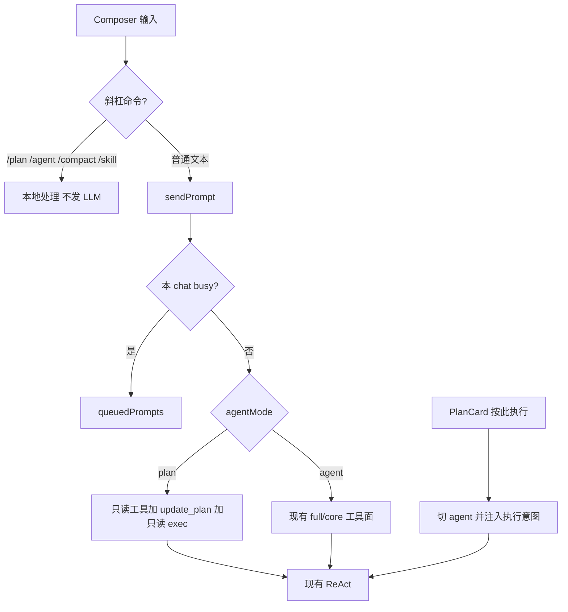
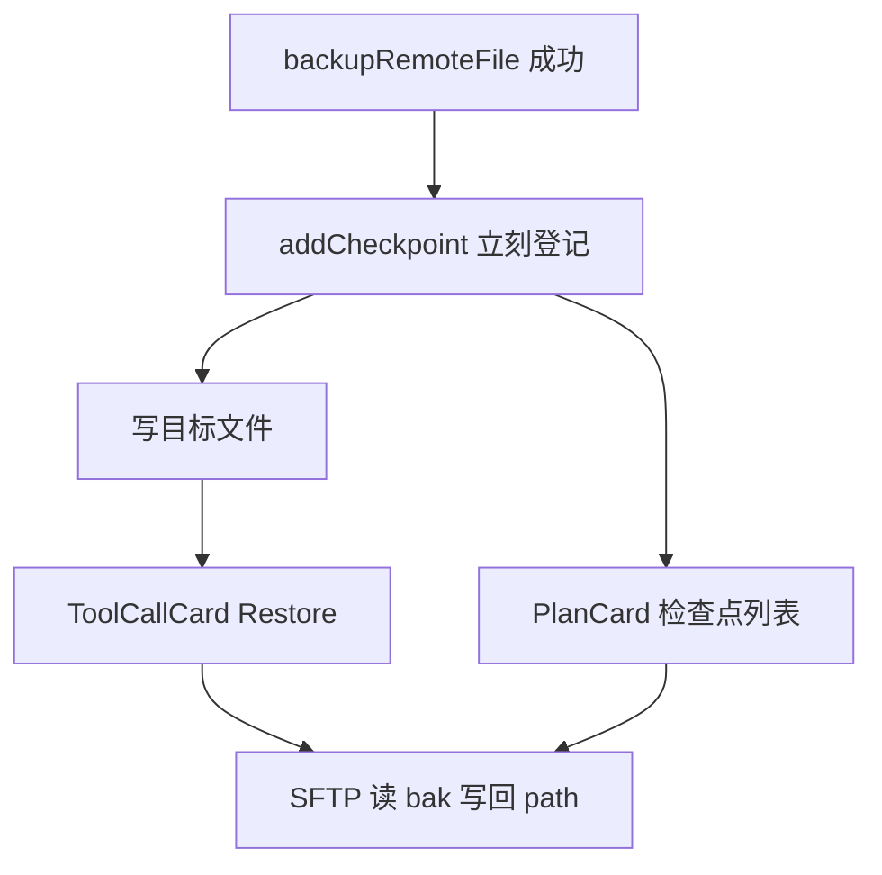

# Copilot Chat P0：Plan 模式、检查点、Composer 与队列

对照 [copilot-prompt-and-agent-loop.md](copilot-prompt-and-agent-loop.md) 第 9.5 节 P0。本文记录本轮落地的数据模型、工具门控、Composer 语法、队列时序与检查点生命周期。

## 范围

- Plan / Agent 分段模式：Plan 只发只读工具 + `update_plan` + `exec_command`（只读命令可跑；写命令 deny）。
- 文件检查点：备份成功后立刻登记；用户点 Restore 写回，不走审批卡。
- Composer：`@/` `@./` `@~/` 路径注入；行首 `/plan` `/agent` `/compact` `/skill` 本地消化。
- 同一 chat 的 `queuedPrompts` 打通：busy 时可发、可见条数、结束后自动发出。
- 待批时 Stop 与 Send 同时在；新指令 supersede 待批并提示。

## 非目标

P1 的 `apply_patch` / git / `AGENTS.md`、P2 的 per-chat busy 与子 Agent。全局 `busy` 不拆。

## 数据模型

`CopilotChatTab` 增加：

- `agentMode?: 'plan' | 'agent'`（缺省 `'agent'`）
- `checkpoints?: FileCheckpoint[]`（最近 30 条）

`FileCheckpoint`：`id`、`terminalTabId`、`path`、`backupPath`、`at`。经 `toPersistedState` / `fromPersistedState` 落盘。

主进程独立重建 tools，因此 `AIChatRequest.planMode` 必须随请求带上，否则 Plan 轮仍会收到写工具。

## Plan 工具门控

| 工具 | Plan 是否出现在 schema | Plan 策略 |
| --- | --- | --- |
| `read_file` / `grep` / `glob` / `list_*` / `read_skill` | 是（档位与 skills 仍门控） | auto |
| `update_plan` | 是 | auto |
| `exec_command` | 是 | 只读（`ps`、`systemctl status`）auto；`systemctl restart` 等 deny |
| `run_in_terminal` / `edit_file` / `write_file` / `open_ssh` | 否 | 即使模型硬调也 deny |
| session allowlist | — | 不能越过 Plan 写门控 |

「按此执行」：`setAgentMode('agent')` + `sendPrompt` 固定意图（中文：「按当前任务计划执行，立刻调用工具，不要再只规划。」）。`startTurn` 每轮重读 `agentMode`，不把模式快照在整个 loop 上。busy 时禁用分段切换。

## Composer 语法

- `@path`：仅当 `@` 后为 `/`、`./`、`~/`。`@nginx` 仍是主机。发送时对钉住/上下文 tab 调 `read_file`（limit 200，最多 4 个文件），注入为本轮（及后续续步）system 片段。读失败 notice，不阻断发送。无 pin 时打开现有终端 picker。
- Slash（行首 `/`，本地，不进 LLM）：

| 命令 | 行为 |
| --- | --- |
| `/plan` | 切 Plan + notice |
| `/agent` | 切 Agent + notice |
| `/compact` | `compactActiveChat()`，成功用 `copilot.context.compressed` |
| `/skill` | 无参列出已启用技能；有参则 `sendPrompt` 要求先 `read_skill` |

输入 `/` 弹出与 TerminalTabPicker 同一定位的短列表；Esc 关闭。

## 队列时序

`SidePanel.sendText` 不再 `if (busy) return`。`sendPrompt` 在 busy 时入队并 `setNotice(copilot.queued)`；`queuedCountByTab` 显示「已排队 N」。

busy 时 toolbar 同时有 Stop 与 Send（Send 仅在输入空时 disabled）。待批条保留「全部批准/拒绝」，主按钮仍是 Send。`cancelPendingApprovals` 之后 notice「已取消 N 个待批，改按新指令执行」。`abortLoop` 清空该 tab 队列。

`useAIStore.subscribe` 在 `busy` 从 true 变 false 时 shift 一条自动 `sendPrompt`。

## 检查点生命周期

登记发生在写目标之前，避免 Stop 留下无索引的 `.bak`。Restore 是用户明确意图，不走审批。失败用 notice。新文件 `write_file` 无备份则无 Restore。

## 涉及文件

- `src/shared/types.ts`、`src/shared/aiTools.ts`、`src/shared/toolPolicy.ts`
- `src/main/ai/provider.ts`
- `src/renderer/store/aiStore.ts`
- `src/renderer/lib/aiService.ts`、`fileTools.ts`、`fileCheckpoints.ts`、`fileMentions.ts`、`slashCommands.ts`
- `src/renderer/components/ai/SidePanel.tsx`、`PlanCard.tsx`、`ToolCallCard.tsx`、`ComposerInput.tsx`、`SlashMenu.tsx`
- `src/renderer/lib/i18n/translations.ts`、`src/renderer/styles/global.css`

## 验收对照第 9.5 节

| 项 | 验收 |
| --- | --- |
| Plan / Agent | Plan 下重启 nginx 只出计划卡片，不打到主机；点「按此执行」后走现有循环 |
| 检查点 | 改配置后可一键还原 bak；Stop 不留下未登记的写 |
| `@path` | `@/etc/nginx.conf` 进入下一轮 context |
| Slash | 输入 `/` 出现菜单 |
| 队列 | busy 可排队、可见条数、结束后自动发出 |
| 待批 UX | busy+pending 仍能点批准；Send 是新指令；supersede 有提示 |
