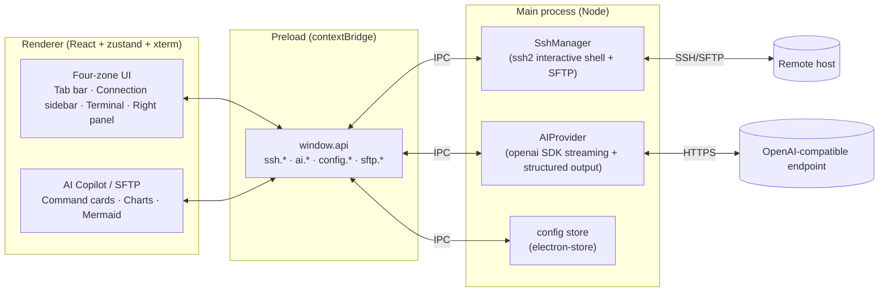
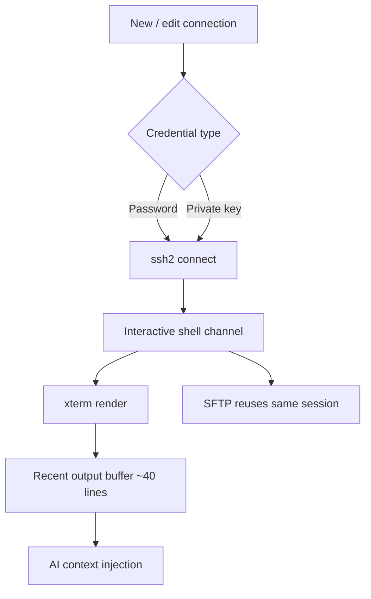

# AI Terminal — Smart Terminal

A multi-tab SSH terminal with a built-in AI Copilot

<div class="pt-8 text-base opacity-80">
  Electron · React · TypeScript · ssh2 · OpenAI-compatible
</div>

<div class="abs-br m-6 text-sm opacity-60">
  Turn natural language into runnable commands
</div>

<!--
Opening: MobaXterm-style multi-tab SSH terminal with an integrated AI Copilot side panel.
-->

---
layout: two-cols
layoutClass: gap-6
---

# Feature Overview

<v-clicks>

- **Multi-tab SSH terminal**: xterm.js interactive shell; status dots show connection / NL mode
- **Connection sidebar**: bookmark tree, recent connections, double-click reconnect / clone
- **AI Copilot**: multi-topic chats, history search, model tier switching, `@terminal` binding
- **Command cards**: Run / Edit / Copy; dangerous commands flagged with a second confirmation
- **Terminal AI mode** (F12): natural language → execute → summarized answer
- **SFTP panel**: browse / upload / download / rename / create folders
- **Visualization**: ECharts live & snapshot charts, Mermaid diagrams, HTML preview
- **Personalization**: Aurora / Dawn themes, Chinese / English UI, local persistence

</v-clicks>

::right::


<div class="text-xs opacity-60 mt-2 text-center">Main UI: connections · terminal · AI Copilot</div>

<!--
New slide: a snapshot plus bullets to build a quick mental model of the product.
-->

---
layout: two-cols
layoutClass: gap-8
---

# The Problem

Real pain points for ops and developers in the terminal:

- Hard to remember obscure flags and pipeline syntax
- Command output is plain text — slow to interpret
- One wrong destructive command can be costly
- Constant context switching between browser, docs, terminal, and file manager
- Invasive AI experiences that don't fit existing workflows

::right::

# Two Core Threads

<v-clicks>

**① Edge Copilot side panel**
A collapsible AI chat panel that automatically reads the last ~40 lines of terminal output and host context; supports multi-topic tabs and archived history search.

**② kubectl-ai style intent execution**
Describe intent in natural language → AI generates shell commands → rendered as **command cards** → confirm and **inject** into the active terminal.

</v-clicks>

<!--
Two threads: side-panel Copilot chat, and intent-to-command execution.
Keywords: context awareness, human-in-the-loop.
-->

---
layout: default
---

# Architecture — Electron Three-Process Model



<div class="text-sm opacity-80 mt-2">

**Security boundary**: API keys live only in the main process and are never sent to the renderer; `contextIsolation` is enabled and the renderer can only call restricted APIs exposed by preload.

</div>

<!--
Classic Electron three layers: renderer / preload / main.
SSH, SFTP, and AI calls run in the main process; the renderer talks via IPC through window.api.
-->

---
layout: two-cols
layoutClass: gap-6
---

# Connections & Sessions

<v-clicks>

### Connection management
- Password / private key (path or contents) / passphrase
- Save connections locally with nested folder groups
- "Recent" dropdown in the tab bar for quick reconnect

### Multi-tab sessions
- `+` new tab, `×` close; status dots show connection state
- Double-click a tab to **reconnect** or **clone** the session
- Right-click menu: save terminal output to a `.log` file

### Mutually exclusive right panels
- **AI Copilot** and **SFTP** share the right slot — opening one closes the other
- All three panel widths are resizable (double-click to reset)

</v-clicks>

::right::



<!--
Connection sidebar + multi-tab + SFTP reusing the same SSH session are day-to-day ops basics.
-->

---
layout: default
---

# AI Capabilities (1) — Intent to Execution

```mermaid {scale: 0.6}
sequenceDiagram
  participant U as User
  participant R as Renderer
  participant M as Main AIProvider
  participant L as LLM
  participant T as Terminal (ssh2)
  U->>R: Natural-language intent
  R->>M: Recent output + host info + model tier
  M->>L: System prompt + context (streaming)
  L-->>R: Streamed reply; commands in ```bash``` blocks
  R->>R: Parse into command cards + danger detection
  U->>R: Click Run / Edit / Copy
  R->>T: Inject command into active terminal
```

<div class="grid grid-cols-3 gap-3 text-sm mt-2">
<div>

**Command cards**: Run / Edit / Copy — edit before running.

</div>
<div>

**Danger guard**: `rm -rf`, `mkfs`, `dd`, fork bombs — flagged red + second confirm.

</div>
<div>

**Multi-topic chats**: up to 5 tabs; archived history is searchable and restorable.

</div>
</div>

<!--
Copilot also supports reasoning display (thinking) and "Ask Copilot" on selected terminal text.
-->

---
layout: default
---

# AI Capabilities (2) — Visualization & Diagrams

<div class="grid grid-cols-2 gap-6">
<div>

### Live charts (two-phase generation)

`@terminal` + "chart as a live line graph"

1. **Phase 1**: model emits only a **natural-language chart description**
2. **Phase 2**: a constrained step turns it into **strict ChartSpec JSON** (json_schema)
3. ECharts subscribes to the terminal **live output stream** (live / static modes)

> The model never hand-writes JSON — fewer format errors.

</div>
<div>

### Mermaid diagrams & more

- `mermaid` code blocks render flowcharts / sequence diagrams live
- **HTML preview** and reasoning (Thinking) display
- **Model tiers**: Default / Fast / Med / High / Custom — Copilot and terminal AI mode configured separately
- **Chat history persistence**: saved locally with search and archive restore

</div>
</div>

<!--
Two-phase design: decouple "understand intent" from "emit structured JSON".
-->

---
layout: two-cols
layoutClass: gap-6
---

# Terminal AI Mode & SFTP

<div>

### In-terminal natural language mode (F12)

<v-clicks>

1. Type a natural-language intent in the shell
2. AI translates to runnable commands (non-streaming, commands only)
3. Dangerous commands require a second confirmation before execution
4. Output is captured and **summarized** by AI

</v-clicks>

<div class="mt-4">

### SFTP file management

- Reuses the active terminal's SSH connection
- Browse remote directories; upload / download files
- Create folders, rename, delete

</div>

</div>

::right::


<div class="text-xs opacity-60 mt-2 text-center">NL mode · live charts · Mermaid · SFTP</div>

<!--
Terminal AI mode complements the Copilot side panel: closed loop in-shell vs. exploration & viz.
-->

---
layout: center
class: text-center
---

# Key Strengths

<div class="grid grid-cols-3 gap-6 text-left mt-6 text-sm">

<div class="p-4 rounded-lg bg-gray-500/10">

### 🔌 Model freedom
Any OpenAI-style `/chat/completions` endpoint: OpenAI, DeepSeek, local vLLM, Ollama; different tiers can use different models.

</div>

<div class="p-4 rounded-lg bg-gray-500/10">

### 🛡️ Safety by design
Keys stay in main process · `contextIsolation` · dangerous-command second confirm · human always in the loop.

</div>

<div class="p-4 rounded-lg bg-gray-500/10">

### 🧠 Context-aware
Automatically attaches recent terminal output and host info; `@terminal` binds live streams for charts.

</div>

<div class="p-4 rounded-lg bg-gray-500/10">

### 📊 Output as insight
Turn text into ECharts charts and Mermaid flowcharts — live and snapshot modes.

</div>

<div class="p-4 rounded-lg bg-gray-500/10">

### 🪶 Lightweight & native
Electron + ssh2 interactive shell, multi-tab + SFTP — close to a MobaXterm-style workflow.

</div>

<div class="p-4 rounded-lg bg-gray-500/10">

### 🌍 Engineering-friendly
Full-stack TypeScript · zustand state · dual themes · zh/en i18n · local persistence.

</div>

</div>

---
layout: default
---

# Roadmap

<div class="grid grid-cols-2 gap-8 mt-4">
<div>

### Near term

<v-clicks>

- Port forwarding / tunnel management
- Multi-step command orchestration and rollback
- Selected terminal output → one-click explain (richer Copilot integration)
- Multi-window / split layouts

</v-clicks>

</div>
<div>

### Medium / long term

<v-clicks>

- Agent mode: let AI complete multi-step ops tasks autonomously
- Local tools / MCP integration to extend callable capabilities
- Team collaboration: shared connections, audit logs
- Smarter security policies and permission tiers

</v-clicks>

</div>
</div>

<!--
Already shipped: chat history, SFTP, bookmark groups, NL mode, charts, i18n, themes, etc.
-->

---
layout: center
class: text-center
---

# Thank You

Turn natural language into runnable commands — a smarter, safer terminal.

<div class="pt-8 text-sm opacity-70">

```bash
cd docs && npm install && npm run dev slides.en.md
```

</div>
