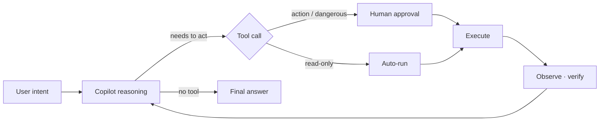

# AI Terminal — Smart Terminal

An SSH terminal with a built-in Agent

<div class="pt-8 text-base opacity-80">
  Multi-tab SSH / WSL · AI Copilot · Autonomous multi-step execution (human-in-the-loop)
</div>

<div class="abs-br m-6 text-sm opacity-60">
  From "chat assistant" to "an ops Agent that acts"
</div>

<!--
Opening: a MobaXterm-style multi-tab terminal whose AI Copilot is not just chat — it calls tools and completes multi-step tasks on its own.
-->

---
layout: two-cols
layoutClass: gap-8
---

# The Problem

Real pain points for ops and developers in the terminal:

- Hard to remember obscure flags and pipeline syntax
- Command output is plain text — slow to interpret
- One wrong destructive command can be costly
- Multi-step troubleshooting means manually looping "type → read → type again"
- Invasive AI experiences that don't fit existing workflows

::right::

# Design: Three Pillars

<v-clicks>

**① Copilot side panel**
A collapsible AI chat panel that reads recent terminal output and host context; supports multi-topic tabs and archived history search.

**② Intent → command**
Describe intent in natural language, AI generates shell commands as **command cards**, confirm and inject into the terminal.

**③ Autonomous multi-step Agent**
Copilot can chain tool calls, observe results, and self-correct until the task is done — **critical actions always need human approval**.

</v-clicks>

<!--
The core is upgraded from "two threads" to "three pillars": chat, intent translation, and — most importantly — the autonomous Agent.
Keywords: context awareness, human-in-the-loop.
-->

---
layout: two-cols
layoutClass: gap-6
---

# Feature Overview

<v-clicks>

- **Multi-tab terminal**: SSH interactive shell + WSL local terminal on Windows
- **Connection sidebar**: nested bookmark folders, recents, right-click reconnect / clone
- **Agent Copilot**: autonomous tool calls, multi-step execution, human-in-the-loop approval
- **Command cards**: Run / Edit / Copy; dangerous commands flagged with a second confirm
- **Terminal AI mode** (F12): natural language → execute → summarized answer
- **SFTP panel**: remote / local dual-pane — browse · upload · download · manage
- **Visualization**: ECharts live / snapshot charts, Mermaid diagrams, HTML preview
- **Customizable**: Skills packs, User Rules, dual themes, Chinese / English UI

</v-clicks>

::right::


<div class="text-xs opacity-60 mt-2 text-center">Main UI: connections · terminal · AI Copilot</div>

<!--
A snapshot plus bullets to build a quick mental model of the product.
-->

---
layout: default
---

# AI Capabilities at a Glance

<div class="text-sm opacity-80 mb-1">Copilot is a guarded, memory-backed <b>Agent loop</b>: it calls tools, observes and verifies, and completes multi-step tasks — with critical actions always approved by a human.</div>


```mermaid {scale: 0.5}
graph LR
  U["User intent"] --> LLM["Copilot reasoning"]
  LLM -->|needs to act| TOOL{"Tool call"}
  LLM -->|no tool| DONE["Final answer"]
  TOOL -->|read-only| AUTO["Auto-run"]
  TOOL -->|"action / dangerous"| APPROVE["Human approval"]
  APPROVE --> RUN["Execute"]
  AUTO --> RUN
  RUN --> OBS["Observe · verify"]
  OBS --> LLM
```

<div class="grid grid-cols-2 gap-x-6 gap-y-2 text-sm mt-2">
<div>

**🤖 Tool calling & approval**
~14 tools (read-only / action / dangerous); read-only auto-runs, actions need approval, dangerous commands get a red flag + second confirm; loop guard + task memory prevent runaway.

</div>
<div>

**🧠 Context engineering**
ContextMeter budget + auto-compression above threshold; on-demand Skills, standing User Rules, `@terminal` binding of context / live stream.

</div>
<div>

**📊 Visualization & terminal AI mode**
ECharts (live / static), Mermaid, HTML preview; F12 in-terminal NL: translate → execute → summarize output.

</div>
<div>

**⚙️ Managing the app itself**
Copilot can read/edit theme / language / terminal appearance / model tiers / User Rules; changes shown as editable approval cards, secrets masked.

</div>
</div>

<!--
Compresses the former 5 AI-detail slides into one overview: the Agent loop diagram + four capability blocks.
Security boundary: keys stay local, dangerous actions need a second confirm, human in the loop.
-->

---
layout: center
class: text-center
---

# Key Strengths

<div class="grid grid-cols-3 gap-6 text-left mt-6 text-sm">

<div class="p-4 rounded-lg bg-gray-500/10">

### 🔌 Model freedom
Any OpenAI-style `/chat/completions`: OpenAI / DeepSeek / local vLLM / Ollama; different tiers can use different models.

</div>

<div class="p-4 rounded-lg bg-gray-500/10">

### 🛡️ Safe & controllable
Keys stay local · dangerous-command second confirm · action tools need approval · human always in the loop.

</div>

<div class="p-4 rounded-lg bg-gray-500/10">

### 🧠 Context-aware
Auto-attaches terminal output and host info; visible budget + auto-compression keep long tasks in bounds.

</div>

<div class="p-4 rounded-lg bg-gray-500/10">

### 🤖 Agent autonomy
Multi-step tool calls + observe/verify + loop guard + task memory — it troubleshoots on its own.

</div>

<div class="p-4 rounded-lg bg-gray-500/10">

### 📊 Output as insight
Turn text into ECharts charts and Mermaid flowcharts — live and snapshot modes.

</div>

<div class="p-4 rounded-lg bg-gray-500/10">

### 🌍 Engineering-friendly
Multi-tab SSH + WSL, SFTP, Skills, dual themes, zh/en i18n, local persistence.

</div>

</div>

---
layout: default
---

# Roadmap

<div class="grid grid-cols-2 gap-8 mt-4">
<div>

### Near term: fill core gaps + deepen the Agent

<v-clicks>

- SSH tunnels / port forwarding, jump host (ProxyJump), 2FA / Agent auth
- Split panes and multi-window layouts; SFTP drag-and-drop and resumable transfer
- Agent plan-execute-rollback: preview and undo multi-step actions
- Persistent memory: retain host knowledge and common ops across sessions

</v-clicks>

</div>
<div>

### Medium / long term: ecosystem & collaboration

<v-clicks>

- MCP / external tool integration to break past built-in tools
- Voice control: speak intent to generate and run commands
- Proactive ops: scheduled checks, anomaly alerts, self-healing suggestions
- Team collaboration: shared connections / Skills, centralized audit logs
- Enterprise security: permission tiers and compliant action trails

</v-clicks>

</div>
</div>

<!--
Already shipped: agentic tool calling, Skills, User Rules, context budget/compression, chat history, SFTP, bookmark groups, NL mode, charts/Mermaid/HTML, i18n, dual themes, model tiers, WSL, etc.
Roadmap targets real gaps: terminal fundamentals (tunnels/split/auth), deeper Agent (rollback/persistent memory), ecosystem & team collaboration.
-->

---
layout: center
class: text-center
---

# Thank You

From "chat assistant" to "an ops Agent that acts" — a smarter, safer terminal.

<div class="pt-8 text-sm opacity-70">

```bash
cd docs && npm install && npm run dev slides.en.md
```

</div>
