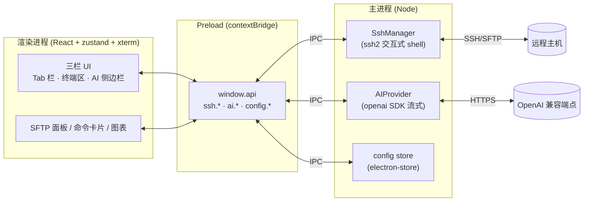
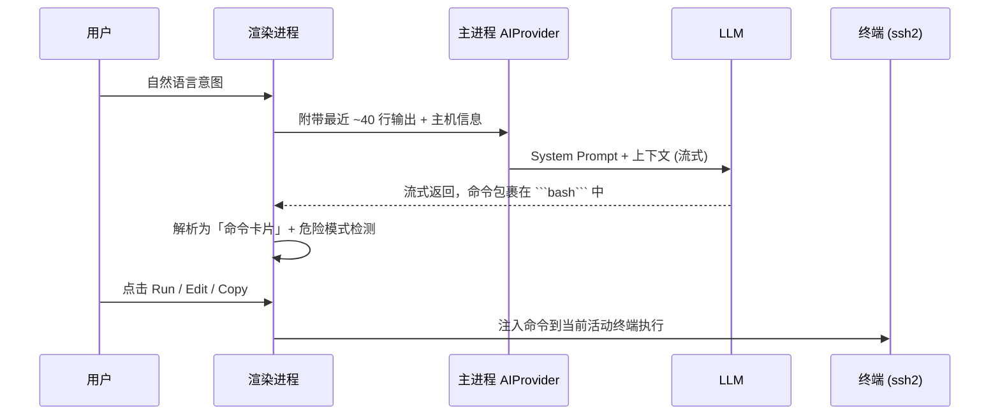

# AI Terminal — 智能终端

一个内置 AI Copilot 的多 Tab SSH 终端

<div class="pt-8 text-base opacity-80">
  Electron · React · TypeScript · ssh2 · OpenAI 兼容
</div>

<div class="abs-br m-6 text-sm opacity-60">
  把「自然语言」变成「可执行命令」
</div>

<!--
开场：这是一个把 AI 助手深度融入 SSH 终端的桌面应用。
融合 Edge Copilot 侧边栏 + kubectl-ai 两种思路。
-->

---
layout: two-cols
layoutClass: gap-8
---

# 它解决什么问题

运维/开发在终端里的真实痛点：

- 记不住冷门命令的参数与管道写法
- 命令输出是「文本」，难以快速理解
- 危险命令一旦误执行，代价高昂
- 在浏览器、文档、终端之间反复切换
- 侵入式 AI 体验，难以集成到现有工作流

::right::

# 核心逻辑：两条主线

<v-clicks>

**① Edge Copilot 侧边栏**
可折叠的 AI 聊天面板，**自动感知**当前终端最近输出与主机上下文。

**② kubectl-ai 式意图执行**
用自然语言描述意图 → AI 生成 shell 命令 → 渲染成**命令卡片** → 确认后**一键注入**终端执行。

</v-clicks>

<!--
两条主线：右侧聊天 Copilot，和把意图翻译成命令直接跑。
关键词：上下文感知、人类确认（human-in-the-loop）。
-->

---
layout: default
---

# 基本架构 — Electron 三层进程



<div class="text-sm opacity-80 mt-2">

**安全边界**：API Key 只存在主进程，永不下发渲染进程；开启 `contextIsolation`，渲染进程仅能调用 Preload 暴露的受限接口。

</div>

<!--
Electron 经典三层：renderer / preload / main。
SSH 与 AI 调用都在主进程，渲染进程通过 IPC 走 window.api。
-->

---
layout: default
---

# AI 能力 (1) — 从意图到执行



<div class="grid grid-cols-2 gap-4 text-sm mt-2">
<div>

**命令卡片**：Run / Edit / Copy，可改后再跑。

</div>
<div>

**危险拦截**：命中 `rm -rf`、`mkfs`、`dd`、fork bomb 等模式自动**标红 + 二次确认**。

</div>
</div>

<!--
关键：上下文自动注入 + 人类确认 + 危险命令防护。
还有终端内 NL 模式：翻译→执行→自然语言总结结果。
-->

---
layout: default
---

# AI 能力 (2) — 可视化与图解

<div class="grid grid-cols-2 gap-6">
<div>

### 实时图表（两阶段生成）

`@terminal` + 「画成实时折线图」

1. **第一阶段**：模型只产出图表的**自然语言描述**（类型/数据来源/列名）
2. **第二阶段**：受约束的步骤把描述转成**严格 ChartSpec JSON**（json_schema）
3. ECharts 订阅终端**实时输出流**渲染

> 模型永不手写 JSON，避免格式错误。

</div>
<div>

### Mermaid 图解

AI 回答中的 `mermaid` 代码块**实时渲染**成流程图 / 时序图。

### 其它增强

- 终端内自然语言模式（翻译→执行→总结）
- SFTP 文件浏览 / 上传 / 下载
- 连接书签与分组、多主题、中英文 i18n

</div>
</div>

<!--
两阶段设计是亮点：把"理解意图"和"生成结构化 JSON"解耦，
弱模型也能稳定产出可渲染的图表规格。
-->

---
layout: center
class: text-center
---

# 优势特点

<div class="grid grid-cols-3 gap-6 text-left mt-6 text-sm">

<div class="p-4 rounded-lg bg-gray-500/10">

### 🔌 模型自由
兼容任何 OpenAI 风格 `/chat/completions`：OpenAI / DeepSeek / 本地 vLLM / Ollama。

</div>

<div class="p-4 rounded-lg bg-gray-500/10">

### 🛡️ 安全可控
Key 仅留主进程 · `contextIsolation` · 危险命令二次确认 · 人类始终在回路中。

</div>

<div class="p-4 rounded-lg bg-gray-500/10">

### 🧠 上下文感知
自动附带终端最近输出与主机信息，回答贴合当前现场。

</div>

<div class="p-4 rounded-lg bg-gray-500/10">

### 📊 输出即洞察
文本输出一键变图表与流程图，理解更快。

</div>

<div class="p-4 rounded-lg bg-gray-500/10">

### 🪶 轻量原生
Electron + ssh2 原生交互式 shell，多 Tab，体验接近 MobaXterm。

</div>

<div class="p-4 rounded-lg bg-gray-500/10">

### 🌍 工程友好
TypeScript 全栈 · zustand 状态 · 严格类型 · 本地持久化。

</div>

</div>

---
layout: default
---

# 未来发展

<div class="grid grid-cols-2 gap-8 mt-4">
<div>

### 近期

<v-clicks>

- 会话历史持久化与检索
- 选中终端输出 → 即时解释
- 端口转发 / 隧道管理
- 命令执行的多步编排与回滚

</v-clicks>

</div>
<div>

### 中长期

<v-clicks>

- Agent 化：让 AI 自主完成多步运维任务
- 本地工具/MCP 集成，扩展可调用能力
- 团队协作：共享连接、审计日志
- 更智能的安全策略与权限分级

</v-clicks>

</div>
</div>

<!--
方向：从"建议命令"走向"可信地自主执行多步任务"，
同时强化安全、审计与团队协作。
-->

---
layout: center
class: text-center
---

# 谢谢观看

把自然语言变成可执行命令，让终端更聪明、更安全。

<div class="pt-8 text-sm opacity-70">

```bash
cd docs && npm install && npm run dev
```

</div>
