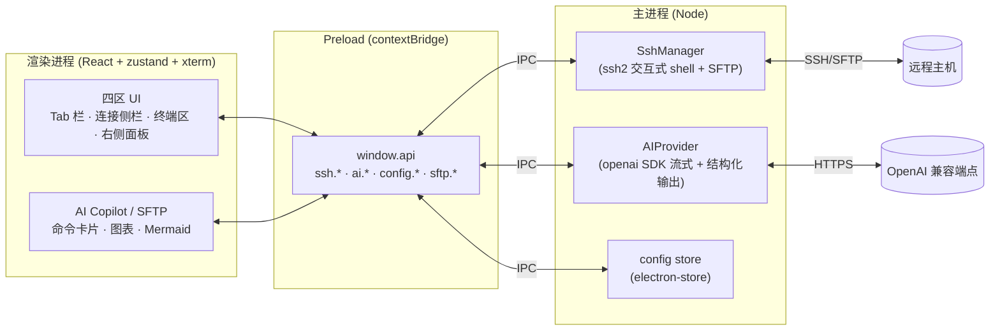
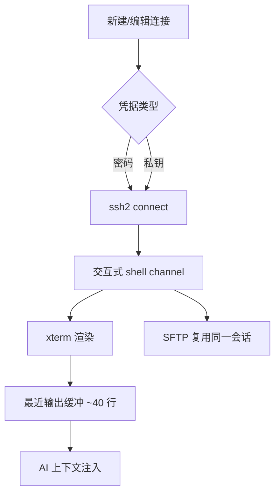
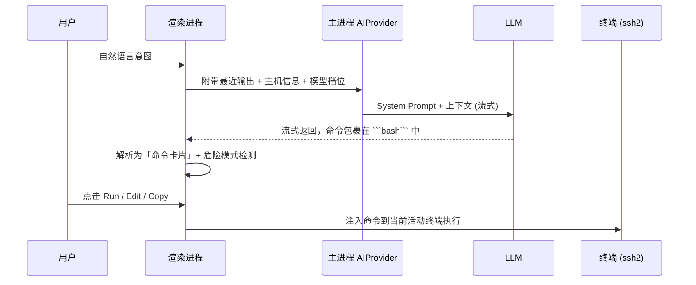

# AI Terminal — 智能终端

一个内置 AI Copilot 的多 Tab SSH 终端

<div class="pt-8 text-base opacity-80">
  Electron · React · TypeScript · ssh2 · OpenAI 兼容
</div>

<div class="abs-br m-6 text-sm opacity-60">
  把「自然语言」变成「可执行命令」
</div>

<!--
开场：MobaXterm 风格的多 Tab SSH 终端，右侧 AI Copilot 深度融入工作流。
-->

---
layout: two-cols
layoutClass: gap-6
---

# 基本功能一览

<v-clicks>

- **多 Tab SSH 终端**：xterm.js 交互式 shell，状态点显示连接/自然语言模式
- **连接侧栏**：书签分组树、最近常用、双击重连/克隆会话
- **AI Copilot**：多话题聊天、历史检索、模型档位切换、@terminal 绑定
- **命令卡片**：Run / Edit / Copy，危险命令标红二次确认
- **终端 AI 模式**（F12）：自然语言 → 执行 → 结果总结
- **SFTP 面板**：浏览 / 上传 / 下载 / 重命名 / 新建文件夹
- **可视化**：ECharts 实时/快照图表、Mermaid 图解、HTML 预览
- **个性化**：Aurora / Dawn 双主题、中/英界面、本地持久化

</v-clicks>

::right::


<div class="text-xs opacity-60 mt-2 text-center">主界面（Dawn 浅色主题 · 中文）：连接侧栏 · 终端区 · AI Copilot</div>

<!--
新增页：用界面快照快速建立产品心智模型。
-->

---
layout: two-cols
layoutClass: gap-8
---

# 它解决什么问题

运维/开发在终端里的真实痛点：

- 记不住冷门命令的参数与管道写法
- 命令输出是「文本」，难以快速理解
- 危险命令一旦误执行，代价高昂
- 在浏览器、文档、终端、文件管理器之间反复切换
- 侵入式 AI 体验，难以集成到现有工作流

::right::

# 核心逻辑：两条主线

<v-clicks>

**① Edge Copilot 侧边栏**
可折叠 AI 聊天面板，自动感知当前终端最近 ~40 行输出与主机上下文；支持多话题 Tab 与历史归档检索。

**② kubectl-ai 式意图执行**
自然语言描述意图 → AI 生成 shell 命令 → 渲染成**命令卡片** → 确认后**一键注入**终端执行。

</v-clicks>

<!--
两条主线：右侧聊天 Copilot，和把意图翻译成命令直接跑。
关键词：上下文感知、人类确认（human-in-the-loop）。
-->

---
layout: default
---

# 基本架构 — Electron 三层进程



<div class="text-sm opacity-80 mt-2">

**安全边界**：API Key 只存在主进程，永不下发渲染进程；开启 `contextIsolation`，渲染进程仅能调用 Preload 暴露的受限接口。

</div>

<!--
Electron 经典三层：renderer / preload / main。
SSH、SFTP 与 AI 调用都在主进程，渲染进程通过 IPC 走 window.api。
-->

---
layout: two-cols
layoutClass: gap-6
---

# 连接与会话

<v-clicks>

### 连接管理
- 密码 / 私钥（路径或内容）/ 口令
- 本地保存连接，嵌套文件夹分组
- 顶栏「最近常用」快速重连

### 多 Tab 会话
- `+` 新建、`×` 关闭，状态点显示连接状态
- 双击 Tab：**重连**或**克隆会话**
- 右键菜单：保存终端输出到 `.log` 文件

### 右侧面板互斥
- **AI Copilot** 与 **SFTP** 共享右侧槽位，打开其一自动关闭另一个
- 三个面板宽度均可拖拽调整（双击重置）

</v-clicks>

::right::



<!--
连接侧栏 + 多 Tab + SFTP 复用同一 SSH 会话，是日常运维的基础能力。
-->

---
layout: default
---

# AI 能力 (1) — 从意图到执行



<div class="grid grid-cols-3 gap-3 text-sm mt-2">
<div>

**命令卡片**：Run / Edit / Copy，可改后再跑。

</div>
<div>

**危险拦截**：`rm -rf`、`mkfs`、`dd`、fork bomb 等标红 + 二次确认。

</div>
<div>

**多话题聊天**：最多 5 个 Tab，历史归档可搜索、可恢复。

</div>
</div>

<!--
Copilot 侧栏还支持推理过程展示（thinking）、终端选中内容「询问 Copilot」。
-->

---
layout: default
---

# AI 能力 (2) — 可视化与图解

<div class="grid grid-cols-2 gap-6">
<div>

### 实时图表（两阶段生成）

`@terminal` + 「画成实时折线图」

1. **第一阶段**：模型只产出图表的**自然语言描述**
2. **第二阶段**：受约束步骤把描述转成**严格 ChartSpec JSON**（json_schema）
3. ECharts 订阅终端**实时输出流**渲染（live / static 两种模式）

> 模型永不手写 JSON，避免格式错误。

</div>
<div>

### Mermaid 图解 & 其它增强

- `mermaid` 代码块**实时渲染**流程图 / 时序图
- 支持 **HTML 预览**、推理过程（Thinking）展示
- **模型档位**：Default / Fast / Med / High / Custom，Copilot 与终端 AI 模式可分别配置
- **聊天历史持久化**：本地保存，支持搜索与归档恢复

</div>
</div>

<!--
两阶段设计是亮点：把"理解意图"和"生成结构化 JSON"解耦。
-->

---
layout: two-cols
layoutClass: gap-6
---

# 终端 AI 模式 & SFTP

<div>

### 终端内自然语言模式（F12）

<v-clicks>

1. 在 shell 中输入自然语言意图
2. AI 翻译为可执行命令（非流式，仅输出命令）
3. 危险命令二次确认后执行
4. 自动捕获输出并由 AI **总结回答**

</v-clicks>

<div class="mt-4">

### SFTP 文件管理

- 复用当前活动终端的 SSH 连接
- 浏览远程目录、上传/下载文件
- 新建文件夹、重命名、删除

</div>

</div>

::right::


<div class="text-xs opacity-60 mt-2 text-center">NL 模式 · 实时图表 · Mermaid · SFTP</div>

<!--
终端 AI 模式与 Copilot 侧栏互补：前者在 shell 内闭环，后者适合探索与可视化。
-->

---
layout: center
class: text-center
---

# 优势特点

<div class="grid grid-cols-3 gap-6 text-left mt-6 text-sm">

<div class="p-4 rounded-lg bg-gray-500/10">

### 🔌 模型自由
兼容任何 OpenAI 风格 `/chat/completions`：OpenAI / DeepSeek / 本地 vLLM / Ollama；多档位可配不同模型。

</div>

<div class="p-4 rounded-lg bg-gray-500/10">

### 🛡️ 安全可控
Key 仅留主进程 · `contextIsolation` · 危险命令二次确认 · 人类始终在回路中。

</div>

<div class="p-4 rounded-lg bg-gray-500/10">

### 🧠 上下文感知
自动附带终端最近输出与主机信息；`@terminal` 绑定实时流用于图表。

</div>

<div class="p-4 rounded-lg bg-gray-500/10">

### 📊 输出即洞察
文本输出一键变 ECharts 图表与 Mermaid 流程图，live / snapshot 双模式。

</div>

<div class="p-4 rounded-lg bg-gray-500/10">

### 🪶 轻量原生
Electron + ssh2 原生交互式 shell，多 Tab + SFTP，体验接近 MobaXterm。

</div>

<div class="p-4 rounded-lg bg-gray-500/10">

### 🌍 工程友好
TypeScript 全栈 · zustand 状态 · 双主题 · 中英文 i18n · 本地持久化。

</div>

</div>

---
layout: default
---

# 未来发展

<div class="grid grid-cols-2 gap-8 mt-4">
<div>

### 近期

<v-clicks>

- 端口转发 / 隧道管理
- 命令执行的多步编排与回滚
- 选中终端输出 → 一键解释（增强 Copilot 联动）
- 多窗口 / 分屏布局

</v-clicks>

</div>
<div>

### 中长期

<v-clicks>

- Agent 化：让 AI 自主完成多步运维任务
- 本地工具 / MCP 集成，扩展可调用能力
- 团队协作：共享连接、审计日志
- 更智能的安全策略与权限分级

</v-clicks>

</div>
</div>

<!--
已实现：会话历史、SFTP、书签分组、NL 模式、图表、i18n、主题等。
-->

---
layout: center
class: text-center
---

# 谢谢观看

把自然语言变成可执行命令，让终端更聪明、更安全。

<div class="pt-8 text-sm opacity-70">

```bash
cd docs && npm install && npm run dev
```

</div>
