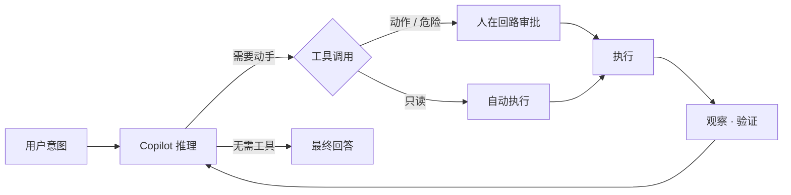

# AI Terminal — 智能终端

一个内置 Agent 的智能 SSH 终端

<div class="pt-8 text-base opacity-80">
  多 Tab SSH / WSL · AI Copilot · 自主多步执行（人在回路）
</div>

<div class="abs-br m-6 text-sm opacity-60">
  从「聊天助手」到「能动手的运维 Agent」
</div>

<!--
开场：MobaXterm 风格的多 Tab 终端，右侧 AI Copilot 不只是聊天，而是能调用工具、自主完成多步任务的 Agent。
-->

---
layout: two-cols
layoutClass: gap-8
---

# 它解决什么问题

运维 / 开发在终端里的真实痛点：

- 记不住冷门命令的参数与管道写法
- 命令输出是「文本」，难以快速理解
- 危险命令一旦误执行，代价高昂
- 多步排障要人肉重复「敲命令 → 看输出 → 再敲」
- 侵入式 AI 体验，难以融入现有工作流

::right::

# 设计思路：三支柱

<v-clicks>

**① Copilot 侧栏**
可折叠 AI 聊天面板，自动感知当前终端最近输出与主机上下文；支持多话题 Tab 与历史归档检索。

**② 意图 → 命令**
自然语言描述意图，AI 生成 shell 命令，渲染成**命令卡片**，确认后一键注入终端执行。

**③ Agent 自主多步执行**
Copilot 能连续调用工具、观察结果、自我纠错，直到完成任务——**关键动作始终由人审批**。

</v-clicks>

<!--
核心从「两条主线」升级为「三支柱」：聊天、意图翻译，以及最重要的 Agent 化自主执行。
关键词：上下文感知、human-in-the-loop。
-->

---
layout: two-cols
layoutClass: gap-6
---

# 基本功能一览

<v-clicks>

- **多 Tab 终端**：SSH 交互式 shell + Windows 下 WSL 本地终端
- **连接侧栏**：书签嵌套分组、最近常用、右键重连 / 克隆会话
- **Agent 化 Copilot**：自主调用工具、多步执行、人在回路审批
- **命令卡片**：Run / Edit / Copy，危险命令标红二次确认
- **终端 AI 模式**（F12）：自然语言 → 执行 → 结果总结
- **SFTP 面板**：远程 / 本地双栏，浏览 · 上传 · 下载 · 管理
- **可视化**：ECharts 实时 / 快照图表、Mermaid 图解、HTML 预览
- **可定制**：Skills 技能包、User Rules 常驻指令、双主题、中英文

</v-clicks>

::right::


<div class="text-xs opacity-60 mt-2 text-center">主界面（Dawn 浅色主题 · 中文）：连接侧栏 · 终端区 · AI Copilot</div>

<!--
用界面快照快速建立产品心智模型。
-->

---
layout: default
---

# AI 能力概览

<div class="text-sm opacity-80 mb-1">Copilot 是一个带守卫与记忆的 <b>Agent 循环</b>：自主调用工具、观察验证、多步完成任务，关键动作始终由人审批。</div>


```mermaid {scale: 0.5}
graph LR
  U["用户意图"] --> LLM["Copilot 推理"]
  LLM -->|需要动手| TOOL{"工具调用"}
  LLM -->|无需工具| DONE["最终回答"]
  TOOL -->|只读| AUTO["自动执行"]
  TOOL -->|"动作 / 危险"| APPROVE["人在回路审批"]
  APPROVE --> RUN["执行"]
  AUTO --> RUN
  RUN --> OBS["观察 · 验证"]
  OBS --> LLM
```

<div class="grid grid-cols-2 gap-x-6 gap-y-2 text-sm mt-2">
<div>

**🤖 工具调用与审批**
约 14 个工具（只读 / 动作 / 危险）；只读自动跑、动作需批准、危险命令红牌二次确认；循环守卫 + 任务记忆防失控。

</div>
<div>

**🧠 上下文工程**
ContextMeter 预算可视化 + 超阈值自动压缩；Skills 按需加载、User Rules 常驻指令、`@terminal` 绑定上下文 / 实时流。

</div>
<div>

**📊 可视化与终端 AI 模式**
ECharts（live / static）、Mermaid、HTML 预览；F12 终端内自然语言：翻译 → 执行 → 总结输出。

</div>
<div>

**⚙️ 管理 App 本身**
Copilot 可读改主题 / 语言 / 终端外观 / 模型档位 / User Rules；改动以可编辑审批卡片呈现，敏感字段脱敏。

</div>
</div>

<!--
把原本 5 页 AI 细节压缩成一页概览：Agent 循环图 + 四块能力速览。
安全边界：Key 只留本地主进程、危险操作二次确认、人在回路。
-->

---
layout: center
class: text-center
---

# 优势特点

<div class="grid grid-cols-3 gap-6 text-left mt-6 text-sm">

<div class="p-4 rounded-lg bg-gray-500/10">

### 🔌 模型自由
兼容任何 OpenAI 风格 `/chat/completions`：OpenAI / DeepSeek / 本地 vLLM / Ollama；多档位可配不同模型。

</div>

<div class="p-4 rounded-lg bg-gray-500/10">

### 🛡️ 安全可控
Key 仅留本地 · 危险命令二次确认 · 动作工具需审批 · 人类始终在回路中。

</div>

<div class="p-4 rounded-lg bg-gray-500/10">

### 🧠 上下文感知
自动附带终端输出与主机信息；预算可视化 + 自动压缩，长任务不爆窗口。

</div>

<div class="p-4 rounded-lg bg-gray-500/10">

### 🤖 Agent 自主
多步工具调用 + 观察验证 + 循环守卫 + 任务记忆，能自己排障。

</div>

<div class="p-4 rounded-lg bg-gray-500/10">

### 📊 输出即洞察
文本输出一键变 ECharts 图表与 Mermaid 流程图，live / snapshot 双模式。

</div>

<div class="p-4 rounded-lg bg-gray-500/10">

### 🌍 工程友好
多 Tab SSH + WSL、SFTP、Skills、双主题、中英文 i18n、本地持久化。

</div>

</div>

---
layout: default
---

# 未来发展

<div class="grid grid-cols-2 gap-8 mt-4">
<div>

### 近期：补齐核心 + Agent 做深

<v-clicks>

- SSH 隧道 / 端口转发，跳板机（ProxyJump）与 2FA / Agent 认证
- 分屏与多窗口布局；SFTP 拖拽传输与断点续传
- Agent 计划-执行-回滚：多步操作可预览、可撤销
- 记忆持久化：跨会话沉淀主机知识与常用操作

</v-clicks>

</div>
<div>

### 中长期：生态与协作

<v-clicks>

- MCP / 外部工具接入，突破内置工具边界
- 语音控制：口述意图直接生成并执行命令
- 主动运维：定时巡检、异常告警与自愈建议
- 团队协作：共享连接 / Skills、集中审计日志
- 企业级安全：权限分级与操作合规留痕

</v-clicks>

</div>
</div>

<!--
已落地：Agent 化工具调用、Skills、User Rules、上下文预算/压缩、会话历史、SFTP、书签分组、NL 模式、图表/Mermaid/HTML、i18n、双主题、模型档位、WSL 等。
路线图聚焦真实缺口：终端基本功（隧道/分屏/认证）、Agent 做深（回滚/持久记忆）、生态与团队协作。
-->

---
layout: center
class: text-center
---

# 谢谢观看

从「聊天助手」到「能动手的运维 Agent」，让终端更聪明、更安全。

<div class="pt-8 text-sm opacity-70">

```bash
cd docs && npm install && npm run dev
```

</div>
