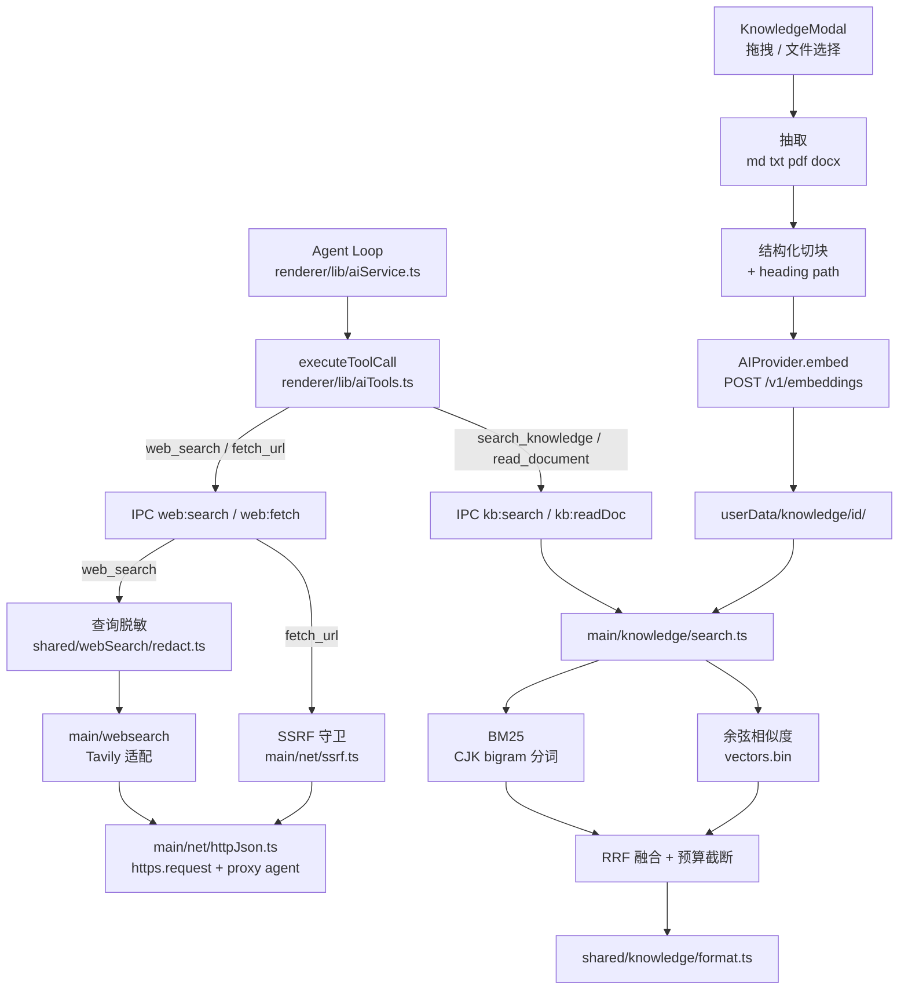
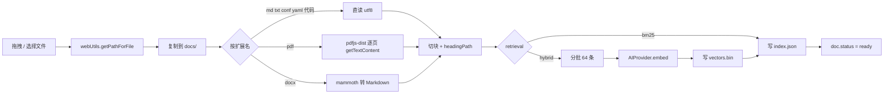
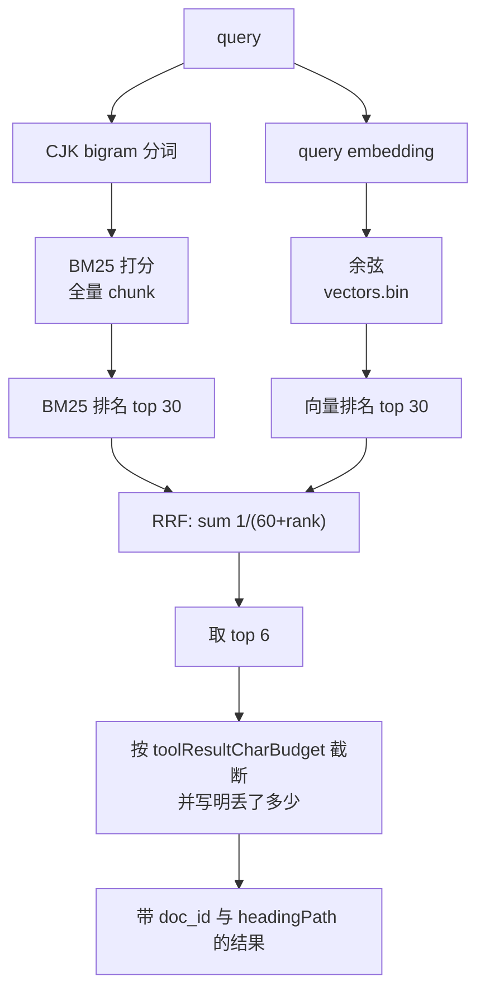
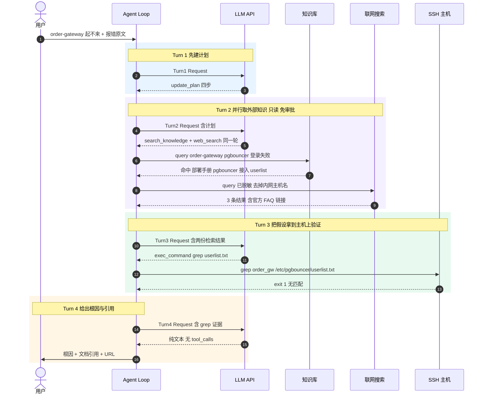
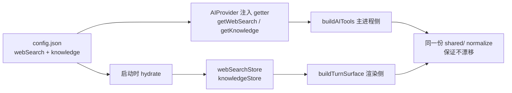

# 联网知识搜索与私有文档 RAG 知识库 —— 设计方案

> 状态：**设计方案，尚未实现**。本文与 [copilot-prompt-and-agent-loop.md](./copilot-prompt-and-agent-loop.md) 配套：那篇描述「现在的循环是什么样」，本篇描述「怎么往这个循环里加两类外部知识，而不推倒重来」。
>
> 本文对应配套文档第 9.2 节缺口表里的「外部可观测性」一行，以及第 9.5 节 P3 之后的能力扩展。

阅读顺序：第 1–2 节是目标与五条设计原则（后面每个技术决定都从这五条推出来）；第 3 节是总体架构图；第 4–5 节分别拆开联网搜索与 RAG 知识库的内部设计；**第 6 节用一条完整的排障轨迹（含时序图）说明两者怎么嵌进现有循环**，想快速理解效果可以先看这节；第 7–8 节是接入既有工具面/审批/prompt 的具体改动，其中 8.1 是一处**必须先修的硬伤**；第 9–12 节是测试、分期、非目标与文件清单。

---

## 1. 要解决的两个问题

| # | 场景 | 现状 | 目标 |
| --- | --- | --- | --- |
| A | 排障时遇到陌生报错、CVE、上游 changelog、某版本才有的新参数 | prompt 里明写 `Cannot ... reach the internet`，模型只能凭训练数据猜 | agent loop 中可按需联网搜索，并在回答里给出 URL |
| B | 调查内部私有程序的问题（自研中间件、内部部署规范、内网架构） | 训练数据里根本没有这些东西，只能靠用户在对话里粘贴 | 用户把私有技术文档拖进本地知识库，agent 自己检索引用 |

两者共同点：**都是把「外部知识」引入循环**，都不改主机状态，都需要引用来源，都需要防止模型把「读到的说法」当成「这台机的事实」。所以放在同一篇设计里，共用一套接入方式和一套 prompt 约束。

---

## 2. 设计原则

这五条是后面所有具体决定的来源，先立在这里。

1. **不新写 agent runtime。** 两个能力都只是「新工具 + 新 IPC + 新设置 + prompt 里多两段」。`aiService.ts` 的 ReAct 循环、`toolPolicy.ts` 的审批、`toolBudget.ts` 的结果预算、Plan/Agent/Execute 三模式，一行都不需要为它们重写。

2. **`search_terminal` 是模板。** 它是仓库里已有的「只读、不碰主机、纯函数核心 + 薄工具壳」范例，改动面正好四处：
   - `src/shared/aiTools.ts` — schema
   - `src/shared/prompts/copilot.ts` — 何时该用它的规则
   - `src/renderer/lib/aiTools.ts` — dispatcher 里一个 case
   - `src/shared/scrollbackSearch.ts` — 纯函数核心 + 单测

   新能力照这个形状长，检索/切块/融合/脱敏全部做成 `src/shared/` 下的纯函数，好测且能在不调真实 LLM 的情况下跑固定轨迹。

3. **知识是假设，不是证据。** 这是最关键的一条 prompt 约束。网页和知识库告诉模型「一般怎么做」，只有主机上的只读命令能告诉它「这台机现在什么样」。检索结果必须被当作待验证的假设，动手前仍要走配套文档第 5 节那套独立校验（本文第 6 节给了一条完整轨迹）。否则新能力会直接腐蚀「改状态必须独立确认」的信誉——一个引用了内部文档、却没在机器上确认过的结论，比没有文档更危险。

4. **默认关闭、渐进披露。** 运维工具常跑在隔离网里。联网搜索默认 `enabled: false`；知识库没有启用集合时，两个 KB 工具的 schema 一律不下发。做法完全照 `hasEnabledSkills()` —— 没装技能就不发 `read_skill` 的 schema，也不写 prompt 里关于技能的段落。

5. **零原生依赖。** 只加 `pdfjs-dist` 与 `mammoth`（都是纯 JS），所以 [electron-builder.yml](../electron-builder.yml) 的 `asarUnpack` / rebuild 配置**不需要动**。向量检索用扁平 `Float32Array` 文件 + 暴力余弦，不引入 sqlite-vec / LanceDB。

---

## 3. 总体架构

新增 4 个工具，全部只读、全部不碰主机、全部不需要 `tab_id`：

| 工具 | 作用 | 档位 |
| --- | --- | --- |
| `web_search` | 联网检索，返回带正文摘要的结果 | full |
| `fetch_url` | 抓单个页面转纯文本（分页，契约照 `read_file`） | full |
| `search_knowledge` | 私有知识库混合检索，返回带 `doc_id` 与小节路径的片段 | full + **core** |
| `read_document` | 读某个入库文档的全文，分页 | full |

`search_knowledge` → `read_document` 与既有的 `grep` → `read_file` 是同一个渐进披露对：先拿片段，片段被截断了就翻原文，而不是换个词再搜一遍。



### 3.1 三层职责划分

| 层 | 放什么 | 为什么 |
| --- | --- | --- |
| `src/shared/**` | 切块、BM25、RRF 融合、结果格式化与预算截断、查询脱敏、设置 normalize | 纯函数，主/渲染两侧共用同一份逻辑，可单测，不需要 Electron 环境 |
| `src/main/**` | 网络请求、代理、DNS/SSRF 判定、文件抽取、索引读写、embeddings 调用 | API key 不进渲染进程；`https-proxy-agent` 与 `dialog` 只在主进程可用；PDF 解析是重活，不该卡 UI 线程 |
| `src/renderer/**` | 工具 dispatcher 的 case、zustand store、Modal 与卡片渲染 | 与既有工具接入方式一致 |

---

## 4. 联网搜索

### 4.1 Provider 抽象：接口先定形，首发只实现 Tavily

```
src/shared/webSearch/
  types.ts      # WebSearchHit / WebSearchQuery / WebSearchSettings
  settings.ts   # normalizeWebSearchSettings（照 normalizeAISettings 写）
  format.ts     # WebSearchHit[] → 给模型的字符串（纯函数）
  redact.ts     # 外发查询脱敏（纯函数）

src/main/websearch/
  index.ts      # searchWeb() 按 provider 分派；fetchUrl()
  tavily.ts     # POST {baseURL}/search
  brave.ts      # 占位，抛「未配置」
  searxng.ts    # 占位，抛「未配置」
  html.ts       # HTML → 纯文本
```

**为什么首发选 Tavily**：它直接返回为 LLM 准备好的 `content` 摘要，首版**不需要自己爬正文**。Brave / Google CSE 只给一句 snippet，必须配合 `fetch_url` 二次抓取才可用——那等于把「搜索」这一个能力拆成两轮 LLM 调用，在 25 轮的 Loop Guard 预算里是实打实的成本。接口按 `searchWeb(query, opts) => WebSearchHit[]` 定形，将来补 Brave / 自建 SearXNG 只是多一个文件。

`format.ts` 要延续 `formatScrollbackResult` 的教训：**超预算时丢最低分的，并且必须在结果里如实写出丢了几条**。以为自己看过全部结果的模型会直接断言「网上没有相关信息」。

### 4.2 HTTP 层有个必须避开的坑

`openai` SDK 吃 `httpAgent`（node-fetch 系），所以 [src/main/ai/provider.ts](../src/main/ai/provider.ts) 里 `createClient()` 把 `https-proxy-agent` 传进去就能走代理。但 **Node 20 的全局 `fetch`（undici）不认 `httpAgent`**，它要的是 `dispatcher`。

结论：新增 `src/main/net/httpJson.ts`，用 `https.request` + 已有的 `https-proxy-agent@^9` 自己发请求，**不要图省事用全局 `fetch`**——那样在配了公司代理的环境里会静默直连并超时，而这类失败最难排查。

代理解析直接复用 [src/shared/aiSettings.ts](../src/shared/aiSettings.ts) 的 `resolveHttpProxy`：它只读 `settings.httpProxy`，把签名放宽成 `Pick<AISettings, 'httpProxy'>` 即可，`NO_PROXY`、CIDR、`:port` 那一整套匹配逻辑白拿。

### 4.3 设置与持久化

[src/main/config/store.ts](../src/main/config/store.ts) 的 `StoreSchema` 新增一个字段，与既有 `skills` / `userRules` 平级：

```ts
export interface WebSearchSettings {
  enabled: boolean            // 默认 false —— 隔离网装机不该被动出网
  provider: 'tavily' | 'brave' | 'searxng'
  apiKey: string
  baseURL: string             // tavily 默认 https://api.tavily.com
  maxResults: number          // 默认 5
  fetchUrl: boolean           // 默认 true
  blockedDomains: string[]
}
```

`getWebSearch()` / `setWebSearch()` 照 `getSkills()` / `setSkills()` 写；IPC 加 `config:getWebSearch` / `config:setWebSearch`。

UI 新增 `src/renderer/components/ai/WebSearchModal.tsx`，沿用 `.modal-overlay / .modal / .modal-header / .modal-body / .modal-footer / .field` 这套类名，与 `SettingsModal` 的「读取 → 本地 state → Save 回写」范式一致。在 [src/renderer/components/TabBar.tsx](../src/renderer/components/TabBar.tsx) 的 `SettingsMenuItem` 加 `'webSearch'`，在 [src/renderer/App.tsx](../src/renderer/App.tsx) 里挂懒加载分支。

### 4.4 安全：两道守卫，都不能省

#### 查询脱敏（`shared/webSearch/redact.ts`）

运维场景里模型极容易把带内网 IP 的报错整行丢给搜索引擎。外发前必须剥掉：

- IPv4 / IPv6 字面量
- 已保存 SSH 配置里出现过的主机名
- key / token 形状的串（长 base64、`AKIA...`、`ghp_...`、`-----BEGIN` 等）

**被剥掉了什么要写回 tool result**，让模型知道自己搜的不是原话——否则它会疑惑为什么搜不到那条「明明很具体」的报错。

#### SSRF 守卫（`main/net/ssrf.ts`），`fetch_url` 专用

这个应用常跑在跳板机上，是 SSRF 危害最大的位置：一条 `fetch_url("http://169.254.169.254/...")` 就能把云元数据读出来。

- DNS 解析后拒绝 loopback / 私网 / link-local / 云元数据地址
- 重定向最多 3 跳，且**每一跳重新解析重新判定**（只查第一跳等于没查）
- 响应体上限 2 MB
- 命中 `blockedDomains` 直接拒

HTML → 文本剥掉 `script/style/nav/footer`，保留标题层级；不引入额外依赖，正则加少量启发式够用——`fetch_url` 的定位是读文档页，不是通用爬虫。

### 4.5 什么时候该搜：prompt 必须写清「不该搜」

如果只写「你可以联网」，模型会把搜索当默认动作，每个问题先搜一遍，浪费轮次还引入噪音。规则要双向：

**不该搜**（主机自己就是权威）：

- 基础参数与用法 → `man` / `--help`，对**这台机的这个版本**才准确
- 本机配置内容 → `read_file` / `grep`
- 内部约定与自研程序 → `search_knowledge`

**该搜**（主机答不了）：

- 陌生报错原文
- CVE 与安全公告
- 上游 changelog / release notes
- 某个新版本才有的参数或行为变化

回答里必须给出 URL。

---

## 5. 私有文档 RAG 知识库

### 5.1 磁盘布局：照 Skills —— 元数据进 config.json，文件进 userData 子目录

```
{userData}/
  config.json                    # knowledge: KnowledgeCollection[]（元数据）
  knowledge/
    <collectionId>/
      docs/<docId>.<ext>         # 原文件副本
      index.json                 # { docs: [...], chunks: [{ docId, headingPath, text, offset }] }
      vectors.bin                # Float32Array，N × dim，第 i 行 ↔ chunks[i]
```

原文件要**复制**进来（`installSkill` 也是 `cp` 整个目录），这样用户之后移动或删掉源文件，知识库不会烂掉。

```ts
export interface KnowledgeCollection {
  id: string
  name: string
  description: string            // 注入 catalog 给模型看的一句话
  enabled: boolean
  retrieval: 'hybrid' | 'bm25'   // bm25 = 零出网
  embeddingModel: string
  dim: number
  docCount: number
  chunkCount: number
  updatedAt: number
}
```

#### 为什么向量单独存二进制文件

| 方案 | 5 万块 × 1024 维 | 取舍 |
| --- | --- | --- |
| JSON 数组 | 约 400 MB，解析数秒 | 每次检索都要付解析成本，不可接受 |
| **`Float32Array` 裸文件** | **约 200 MB，`readFile` 后零解析** | **选它**：`new Float32Array(buf.buffer)` 直接就是视图 |
| sqlite-vec / LanceDB | 更快、支持 ANN | 引入原生模块，要改 `asarUnpack` 与 rebuild，且要处理多平台 prebuild |

暴力余弦在 5 万块 × 1024 维下约 5000 万次乘加，JS 里 50–100 ms，对一次工具调用完全够用。上限约 10 万块；越过再换 ANN，那是一次**独立决策**，现在不预付这个复杂度。

### 5.2 入库流水线



#### 导入入口有个 Electron 版本陷阱

仓库现有的拖拽（`TAB_DRAG_MIME` / `PANE_DRAG_MIME` / 书签树）**都只做 UI 重排，没有系统文件拖入的先例**——`tabDrag.ts` 的测试甚至刻意断言 `isTabDrag(fakeTransfer(['Files'])) === false`。所以这条要新写，并且注意：

> **Electron 32 起 `File.path` 已被移除。** 必须在 preload 里暴露 `webUtils.getPathForFile(file)` 才能从拖进来的 `File` 拿到绝对路径。本仓库用 Electron 33，直接读 `file.path` 会拿到 `undefined`。

同时提供「选择文件…」按钮走 `dialog.showOpenDialog({ properties: ['openFile', 'multiSelections'], filters })`，抄 [src/main/ipc.ts](../src/main/ipc.ts) 里 `sftp:upload` 的写法。两条路都要有：拖拽顺手，按钮在无窗口焦点或远程桌面下更可靠。

#### 抽取（`main/knowledge/extract.ts`）

| 类型 | 做法 | 注意 |
| --- | --- | --- |
| md / markdown / txt / rst / log / conf / yaml / json / 代码 | `readFile` utf8 | 编码非 UTF-8 时给明确错误，不猜 |
| pdf | `pdfjs-dist` legacy build，逐页 `getTextContent()` | **动态 import**，照 provider.ts 里 `loadOpenAI()` 的懒加载，避免拖慢启动 |
| docx | `mammoth` → `convertToMarkdown` | 转 Markdown 而非纯文本，保住标题层级，切块质量差别很大 |

扫描版 / 加密 PDF 直接报明确错误。**不做 OCR**（见第 11 节非目标）。

#### 切块（`shared/knowledge/chunk.ts`，纯函数）

1. 先按 Markdown 标题切（`#` 到 `######`）
2. 再硬切到约 1200 字符、150 字符重叠
3. **绝不切开代码围栏**——半个 `nginx.conf` 片段既误导模型又污染 BM25
4. 每块带 `headingPath`，例如 `内部部署手册 › 灰度发布 › 回滚步骤`

`headingPath` 同时改善两件事：BM25 命中（标题里通常是最核心的术语）和引用可读性（用户看到的是「文档 › 小节」而不是一个 chunk 序号）。

#### 向量化

`AIProvider` 新增 `embed(texts, profile)`，走 `client.embeddings.create`。`openai` SDK 本来就支持，且复用 `createClient()` 的 baseURL / apiKey / 代理解析——**这是零额外工作拿到 Ollama、vLLM、SiliconFlow、OpenAI 全兼容的关键**。设置里加 `embeddingModel` 与 `embeddingProfile`。

#### 进度、取消与断点续跑

一份 200 页 PDF 是几百次 embed 调用，这是本方案里唯一的长耗时操作，必须做完整：

- `kb:progress` 流式事件（照 `ai:chunk` 的 `e.sender.send` 模式）驱动 Modal 进度条
- 可取消
- `index.json` 里每个 doc 带 `status: pending | indexing | ready | failed`，**重启后能续跑或重试**

半途关掉应用不能留下一个永远显示「处理中」的集合——那种状态用户只能靠删掉重建来摆脱。

### 5.3 混合检索：BM25 + 向量 + RRF



#### 中文分词是这一块最关键的正确性细节

私有技术文档基本是中文，**按空白分词会直接失效**：「灰度发布回滚」是一个 token，查「回滚」永远命中不了。

方案：**CJK 连续段取字符 bigram，ASCII 段取单词**，无需任何分词依赖。「灰度发布」→ `灰度 / 度发 / 发布`，查「发布」的 bigram `发布` 就能命中。这是轻量全文检索的常规做法，对中文召回足够，而且是纯函数、好测。

这条如果做错，整个知识库看起来「建好了但搜不到东西」，且很难归因——所以它单独有一个测试文件（第 9 节）。

#### 为什么融合用 RRF 而不是加权求和

BM25 分数无上界、余弦在 `[-1,1]`，加权求和必须先归一化，而归一化对分布敏感、需要调参。**RRF 只看排名**（`score = Σ 1/(60+rank)`），不需要归一化，且某一路失效时退化得很干净：

- 集合配成 `retrieval: 'bm25'`（无向量）→ 自动就是纯 BM25
- embedding 端点临时挂了 → 降级成纯 BM25，而不是返回一堆噪音
- 查询是精确串（错误码、函数名）→ BM25 那一路自然占优
- 查询是自然语言描述 → 向量那一路自然占优

重排先不做，留一个「LLM 重排 top20 → top5」的设置位。

### 5.4 隐私：用户要放的是「私有技术文档」，这条必须显式

文件本身不出机器，但**切块文本会发给 embedding 端点**。如果那个端点是云服务，私有文档就出网了。所以：

1. `KnowledgeModal` 显示当前解析出的 embedding 端点主机名，对非 loopback / 非私网端点给出明确提示。
2. 每个集合支持 `retrieval: 'bm25'`：**零出网**，也不需要配 embedding 端点。

第 2 点正是选混合检索架构顺带拿到的好处——敏感集合可以单独降级，而不是整个功能二选一。

### 5.5 引用

回答里必须引用 `文档名 › 小节`，prompt 里写死。`ToolCallCard` 加 `search_knowledge` 分支：命中列表 + 可展开片段 + 「打开原文」（`shell.showItemInFolder`），参考 [src/renderer/components/ai/ToolCallCard.tsx](../src/renderer/components/ai/ToolCallCard.tsx) 里 `ToolResult` 按工具名分派的写法（约 642 行）。

---

## 6. 示例：一次同时用到两种知识的排障轨迹

前面都是静态结构，这一节用一条具体任务说明**新工具怎么嵌进既有循环**，以及第 2 节那条「知识是假设，不是证据」在轨迹上长什么样。

场景设定：

- 用户在 Copilot 输入：**「内部的 order-gateway 在 prod 上起不来，日志里有 `pgbouncer: server login has been failing`，帮我查一下」**
- 对话钉在 `tab_7f3a`（`root@prod.example.com`，已连接）
- 档位 Default（full 工具），模式 **Agent**，自主度 **balanced**
- 知识库里有一个启用的集合「内部中间件手册」（含 `order-gateway 部署手册.docx`）
- 联网搜索已开启，provider = Tavily

### 6.1 时序图



### 6.2 这条轨迹说明了什么

**步骤 5–9：一轮里并行发两个检索。** `search_knowledge` 和 `web_search` 都在 `READONLY_TOOLS` 里，`decideToolCall` 判 `auto`，所以两条都不弹审批、走既有的只读并行 `Promise.all`。用户看到两张卡片，不用点任何东西。

**步骤 8：查询在出网前被脱敏。** 模型写的查询里带了 `prod.example.com`，`redact.ts` 把它剥掉再发给 Tavily，并在 tool result 里注明「已移除 1 个主机名」。模型因此知道自己搜的不是原话，不会疑惑为什么结果不够精确。

**步骤 11–13：这是整条轨迹的重点。** 内部手册说「order-gateway 必须先注册到 pgbouncer 的 `userlist.txt`」——但这只是**手册的说法**，不是**这台机的事实**。模型没有直接下结论，而是跑了一条只读 `grep` 去主机上确认，拿到 `exit 1`（无匹配）才敢说这就是根因。

如果没有第 2 节那条 prompt 约束，模型很可能在 Turn 3 就直接回答「按手册你需要注册 userlist」——听起来专业、有出处，但没有任何证据表明这台机上真的缺这一行。**有引用的猜测比没引用的猜测更危险**，因为它更容易被相信。

**步骤 15–16：回答带两种引用。** 内部结论引 `内部中间件手册 › order-gateway 部署手册 › pgbouncer 接入`，外部结论引 URL。用户可以分别去核。

### 6.3 对照：Plan 模式下的同一句话

同样这句话在 **Plan** 模式下，步骤 5–13 **一模一样**——`search_knowledge` / `web_search` / 只读 `grep` 全部在 `PLAN_MODE_TOOLS` 里（由 `...READONLY_TOOLS` 展开自动获得）。区别只在收尾：Plan 不给结论性修复动作，而是产出一份「已确认缺 userlist 记录 → 建议补一行并 reload」的计划卡片，用户点「按此执行」才切到 Execute 去改。

这正是 7.1 节表格里那句「Plan 模式因此显著变强」的实际含义：**用户原始需求里的「调查内部私有程序问题」，在 Plan 模式下变成了一条全程免审批的只读调查链。**

---

## 7. 接入现有工具面、审批与三模式

### 7.1 `src/shared/aiTools.ts`

| 改动 | 内容 | 理由 |
| --- | --- | --- |
| `BASE_TOOLS` | 加 4 个 schema | — |
| `READONLY_TOOLS` | 4 个全加 | 它们确实什么都不改，于是**自动**获得：`isAutoApprovedTool` → auto、`PLAN_MODE_TOOLS`（由 `...READONLY_TOOLS` 展开）放行、prompt `inventory()` 归入 read-only 一栏 |
| `HOST_MUTATING_TOOLS` | **不加** | 不需要 `hostLock` 串行——它们不碰主机 |
| `PIN_DEFAULT_TOOLS` | **不加** | 它们没有 `tab_id` 参数 |
| `CORE_TIER_TOOLS` | 只加 `search_knowledge` | 本地小模型最缺的就是私有领域知识，这一个 schema 很小、收益最大；其余三个留 full 档，避免 fast 档 schema 膨胀（配套文档 9.6 节既定非目标） |
| `ToolSurfaceOptions` | 加 `hasWebSearch?` / `hasKnowledge?` | 与 `hasSkills` 完全同构，在 `buildAITools` 里过滤 |

**Plan 模式因此显著变强。** 用户的原始需求「调查内部私有程序问题」正是 Plan 模式的主场：只读探查 + 写计划。4 个工具落进 `READONLY_TOOLS` 后，Plan 模式下可以联网查 CVE、查内部文档、然后写出一份有依据的计划，全程不需要一次审批。这是不额外写代码就拿到的收益。

### 7.2 `src/shared/toolPolicy.ts`

`web_search` / `fetch_url` 虽然只读，但**会出网、会花钱**，不该和读本地文件同一档。在 `decideToolCall` 里 `isAutoApprovedTool` 之前插一段：

| 自主度 | `web_search` / `fetch_url` |
| --- | --- |
| `conservative` | `ask` |
| `balanced`（默认） | `auto` |
| `autonomous` | `auto` |

必须插在 `isAutoApprovedTool` **之前**——那个分支会直接 `return 'auto'`，根本不看 mode。

KB 两个工具是纯本地读，不需要特例。

### 7.3 两处必须同步的门控（容易漏）

`provider.chat()` **会自己重建 tools 和 prompt**（见配套文档第 3 节），所以门控信息有两个消费者：



- **主进程**：`AIProvider` 构造函数已经注入了 `() => config.getSkills()`（见 [src/main/ipc.ts](../src/main/ipc.ts) 约 93–97 行），照样再注入 `() => config.getWebSearch()` 和 `() => config.getKnowledge()`。让主进程**直接读配置**比让渲染进程传 DTO 更不容易漂移。
- **渲染进程**：新增 `webSearchStore` / `knowledgeStore`（zustand，启动时 hydrate，照 `skillsStore`）。因为 `buildTurnSurface` 是同步函数，`hasWebSearch()` / `hasKnowledge()` 必须同步可答，不能 await IPC。

两侧共用 `src/shared/` 里同一个 normalize 函数，这是防漂移的关键。

---

## 8. Prompt 改动：有一处硬伤必须先修

### 8.1 `Cannot ... reach the internet` 是必须改的

[src/shared/prompts/copilot.ts](../src/shared/prompts/copilot.ts) 的 `constraints()`（约 354–360 行）现在写着：

```text
- Cannot: act on hosts not already open as tabs, see scrollback for a tab that is not
  open, reach the internet, or persist local files beyond saved SSH configs/settings;
  exec_command needs an open, CONNECTED tab.
```

有了 `web_search`，`reach the internet` 就是**假的限制**，而信了它的模型根本不会去调这个工具。这和当年加 `search_terminal` 时必须改掉 `You cannot see scrollback beyond that snippet` 是**完全同一个坑**——配套文档 P2 那一行已经记过一次教训：

> 同时必须改 prompt：原来那句「You cannot see scrollback beyond that snippet」有了这个工具就是假的限制，而信了它的模型会去重跑命令。

改法：把 `reach the internet` 变成 `t.has('web_search')` 条件项，与 `search_terminal` 那处的写法一致。

### 8.2 其余按 `ToolSet` 门控新增

| 位置 | 新增内容 |
| --- | --- |
| `environment()` | 一行知识库集合目录说明，照 `t.has('read_skill')` 那行技能目录 |
| `toolRules()` | 一段「外部知识」：何时搜网 vs 何时问主机 vs 何时查知识库；**检索结果是假设不是证据**；回答要给 URL 或「文档 › 小节」引用；不要把内网 IP、主机名、密钥写进搜索查询 |

### 8.3 改完必须重新 dump

配套文档第 2 节承诺贴文与 dump **字节一致**。改完 prompt 要跑：

```bash
npx tsx scripts/dumpPrompt.ts full
```

然后回填 [copilot-prompt-and-agent-loop.md](./copilot-prompt-and-agent-loop.md) 第 2 节全文与字符数（现在是 11042），以及 `fast` 档的 8776。别手改。

---

## 9. 测试

延续仓库「核心逻辑做成纯函数再测」的风格（`scrollbackSearch` 是纯函数所以能跑固定轨迹，`runSubAgent` 的执行器是注入的所以能不调真实 LLM）：

| 测试文件 | 断言什么 | 为什么值得单独测 |
| --- | --- | --- |
| `shared/knowledge/chunk.test.ts` | 标题切分、代码围栏不被切开、重叠正确 | 切错了检索结果永远是半截配置 |
| `shared/knowledge/bm25.test.ts` | **中文 bigram 分词能召回中文文档** | 做错了整个知识库「建好了但搜不到」，且极难归因 |
| `shared/knowledge/fuse.test.ts` | RRF 排序正确；一路为空时退化正确 | 降级路径不能靠人肉验证 |
| `shared/knowledge/format.test.ts` | 超预算时截断，且**结果里如实写出丢了多少** | scrollback 那条教训：谎报「没找到」比返回不全更糟 |
| `shared/webSearch/redact.test.ts` | IP / 主机名 / 密钥形状被剥掉 | 泄露不可逆 |
| `main/net/ssrf.test.ts` | 私网被拒；**重定向到私网也被拒** | 只查第一跳等于没查 |
| `shared/aiTools.test.ts` | schema 按 `hasWebSearch` / `hasKnowledge` 门控 | — |
| `shared/prompts/copilot.test.ts` | **带 `web_search` 时 prompt 里不再出现 “reach the internet”** | 这是 7.1 那处硬伤的回归防线 |

---

## 10. 分期路线：每一期都能独立交付

### 第 1 期 —— KB 骨架（零新依赖、零出网）

设置 + IPC + 导入 md/txt + 切块 + BM25 + `search_knowledge` + Modal 与拖拽 + prompt 与集合目录注入。

**做完就已经能回答「查内部程序问题」**，且不需要配任何 embedding 端点、不装任何新依赖、一个字节都不出网。这是刻意的排序：先把最有价值、风险最低的部分跑通。

### 第 2 期 —— 检索质量与格式覆盖

PDF / DOCX 抽取 + `AIProvider.embed` + `vectors.bin` + RRF 混合 + 进度/取消/断点续跑 + `read_document`。

### 第 3 期 —— 联网搜索

Tavily 适配 + 查询脱敏 + prompt 规则改造（含 8.1 那处）+ `fetch_url` + SSRF 守卫 + 卡片 UI。

放在第三是因为它是**唯一会让数据离开这台机器**的一期，前两期的门控与审批范式先站稳，再开出网的口子。

### 第 4 期 —— 打磨

可选 LLM 重排、引用渲染、集合级 `bm25-only` 开关、轨迹评测 fixture，并把这两项能力写回 [copilot-prompt-and-agent-loop.md](./copilot-prompt-and-agent-loop.md)：第 9.2 节「外部可观测性」缺口表要更新，第 2 节 prompt 全文要重新 dump。

---

## 11. 显式非目标

- 不做 OCR、不做通用网页爬虫、不做浏览器 Agent 或 Computer Use（与配套文档 9.6 一致）。
- 不引入原生向量库（sqlite-vec / LanceDB）。扁平向量文件撑不住时再谈，那是一次独立决策。
- 不把 4 个工具都塞进 fast 档；只有 `search_knowledge` 进 core。
- 知识库不做跨机同步、不做云端托管，纯本地 `userData`。
- 不提供「跳过全部权限」档；`conservative` 下出网工具仍然要批。

---

## 12. 新增与修改文件清单

### 新增

```
src/shared/webSearch/{types,settings,format,redact}.ts
src/shared/knowledge/{types,chunk,bm25,fuse,format}.ts
src/main/net/{httpJson,ssrf}.ts
src/main/websearch/{index,tavily,brave,searxng,html}.ts
src/main/knowledge/{store,extract,index,search}.ts
src/renderer/store/{webSearchStore,knowledgeStore}.ts
src/renderer/components/ai/{WebSearchModal,KnowledgeModal}.tsx
```

### 修改

| 文件 | 改什么 |
| --- | --- |
| [src/shared/aiTools.ts](../src/shared/aiTools.ts) | 4 个 schema、`READONLY_TOOLS`、`CORE_TIER_TOOLS`、`ToolSurfaceOptions` |
| [src/shared/toolPolicy.ts](../src/shared/toolPolicy.ts) | 出网工具在 `conservative` 下 `ask` |
| [src/shared/prompts/copilot.ts](../src/shared/prompts/copilot.ts) | 去掉假的联网限制、`environment` 加集合目录、`toolRules` 加外部知识段 |
| [src/shared/aiSettings.ts](../src/shared/aiSettings.ts) | `resolveHttpProxy` 签名放宽为 `Pick<AISettings, 'httpProxy'>` |
| [src/main/config/store.ts](../src/main/config/store.ts) | `StoreSchema` 加 `webSearch` / `knowledge` 及 getter/setter |
| [src/main/ai/provider.ts](../src/main/ai/provider.ts) | 新增 `embed()`；`buildAITools` 带上两个新门控 |
| [src/main/ipc.ts](../src/main/ipc.ts) | `web:*` / `kb:*` / `config:*WebSearch` 处理器；`AIProvider` 多注入两个 getter |
| [src/preload/index.ts](../src/preload/index.ts) + `index.d.ts` | `api.web.*` / `api.knowledge.*`、`webUtils.getPathForFile` |
| [src/renderer/lib/aiTools.ts](../src/renderer/lib/aiTools.ts) | dispatcher 加 4 个 case、`hasWebSearch()` / `hasKnowledge()`、`buildKnowledgeContextMessage()` |
| [src/renderer/lib/aiService.ts](../src/renderer/lib/aiService.ts) | `buildTurnSurface` 带上新门控；集合目录进 prefix 层 |
| [src/renderer/components/ai/ToolCallCard.tsx](../src/renderer/components/ai/ToolCallCard.tsx) | `TOOL_CATEGORY` 与 `search_knowledge` 结果渲染 |
| [src/renderer/components/TabBar.tsx](../src/renderer/components/TabBar.tsx) + [App.tsx](../src/renderer/App.tsx) | 两个新设置项入口 |
| [src/renderer/lib/i18n/translations.ts](../src/renderer/lib/i18n/translations.ts) | `tool.action.*` / `tool.desc.*` / 两个 Modal 的 zh + en |
| [package.json](../package.json) | `pdfjs-dist`、`mammoth` |
